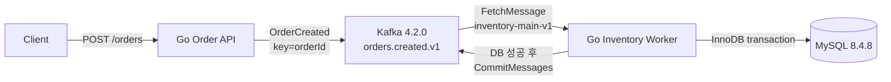

# kafka-recovery-lab

Kafka 메시지는 재전달될 수 있다는 전제에서, 재고 반영의 중복을 막고 재시도·복구 부하를 통제하는 과정을 단계별 실험으로 증명하는 Go 프로젝트다.

기존 티켓 예매 프로젝트에서 단순 DLQ 처리 후 남았던 질문에서 출발했다. 현재 Phase 2까지 완료했으며, 아직 Retry·DLQ·Idempotency·Replay 해결책은 구현하지 않았다. 가장 중요한 현재 결과는 DB commit 후 Kafka offset commit 전에 Worker가 종료되면 같은 이벤트가 재전달되어 재고가 **100 → 98 → 96**으로 중복 차감된다는 실측이다.

## Architecture



| 구성 | 선택 |
| --- | --- |
| Go | 1.26.5, 표준 `net/http`, `database/sql`, `log/slog` |
| Kafka client | `github.com/segmentio/kafka-go` v0.4.51 |
| MySQL driver | `github.com/go-sql-driver/mysql` v1.10.0 |
| Local infrastructure | Docker Compose, 단일 KRaft Kafka, InnoDB MySQL |

## Development Journey

### Phase 0 — Reproducible Environment

문제: 장애 실험 전에 Kafka·MySQL의 실행과 데이터 영속성을 같은 조건으로 반복할 기준선이 필요했다.

구현·검증: 단일 KRaft broker와 InnoDB MySQL을 Compose로 구성하고 healthcheck, named volume, 명시적 topic 생성, Kafka 실제 produce/consume, SQL, MySQL 재시작 검사를 자동화했다.

핵심 결과: 사용자 검증 14개가 모두 PASS했고, Kafka 4.2.0과 MySQL 8.4.8 환경에서 메시지 왕복과 재시작 후 probe row 보존을 확인했다.

[Phase 0 상세 문서](docs/phase-0-environment.md) · [원시 검증 보고서](docs/phase-0-verification.md)

### Phase 1 — Normal Order-to-Inventory Flow

문제: 장애 경계를 판단하려면 DB transaction과 Kafka offset commit 순서가 분명한 정상 흐름이 먼저 필요했다.

구현·검증: `POST /orders → OrderCreated → orders.created.v1 → Inventory Worker → MySQL → CommitMessages`를 구현했다. `FetchMessage`로 읽고 DB commit 성공 후에만 offset을 수동 commit한다.

핵심 결과: 정상 요청 7건의 quantity 합계 19가 재고 100→81로 반영됐다. 잘못된 요청 5건은 Kafka에 발행되지 않았고, 정상 Worker 재시작 후 추가 처리는 0건이었다.

[Phase 1 상세 문서](docs/phase-1-normal-flow.md) · [원시 검증 보고서](docs/phase-1-verification.md) · [Evidence](docs/phase-1-evidence.json)

### Phase 2 — Kafka/MySQL Failure Boundaries

문제: MySQL commit과 Kafka offset commit은 원자적이지 않으며, 영구 실패 record를 격리할 정책도 없었다.

구현·검증: 특정 eventId에서만 동작하는 최소 fault hook으로 MySQL 장애, DB commit 전 crash, DB commit 후 crash, poison message를 실제 Worker 프로세스에서 재현했다. DB와 broker 상태는 Worker 밖에서 교차 확인했다.

핵심 결과:

- DB commit 전 crash: transaction rollback, offset 미commit, 동일 record 재전달
- DB commit 후 offset commit 전 crash: 동일 eventId 재전달과 재고 100→98→96 중복 반영
- Poison message: 두 번의 Worker 실행에서 같은 record가 실패하고 같은 partition의 정상 후속 record가 처리되지 않음

[Phase 2 상세 문서](docs/phase-2-failure-boundaries.md) · [원시 검증 보고서](docs/phase-2-verification.md) · [Evidence](docs/phase-2-evidence.json)

## Run locally

프로젝트 루트 PowerShell에서 실행한다.

```powershell
. ./scripts/env.ps1 -Init
go mod download
docker compose up -d --wait
powershell -NoProfile -ExecutionPolicy Bypass -File scripts/verify.ps1 -Check Topics
powershell -NoProfile -ExecutionPolicy Bypass -File scripts/init-inventory.ps1 -Seed
```

별도 터미널에서 Worker와 API를 실행한다.

```powershell
. ./scripts/env.ps1
go run ./cmd/worker
```

```powershell
. ./scripts/env.ps1
go run ./cmd/api
```

```powershell
Invoke-RestMethod -Method Post -Uri http://127.0.0.1:8080/orders `
  -ContentType application/json -Body '{"productId":1,"quantity":1}'
```

## Verification

```powershell
# Phase 0 environment
powershell -NoProfile -ExecutionPolicy Bypass -File scripts/verify.ps1 -Check All

# Phase 1 normal flow and earlier regression
powershell -NoProfile -ExecutionPolicy Bypass -File scripts/verify-phase1.ps1 -Check All

# Phase 2 failure scenarios and earlier regressions
powershell -NoProfile -ExecutionPolicy Bypass -File scripts/verify-phase2.ps1 -Check All
```

Phase 2의 A는 공유 로컬 MySQL 컨테이너를 실제 중지하므로 다른 애플리케이션과 병행하지 않는다. 각 장애 시나리오는 새 product, topic, group을 사용하며 기존 offset이나 inventory를 초기화하지 않는다.

## Current limits

- DB commit과 Kafka offset commit 사이의 중복 처리는 아직 해결하지 않았다.
- Poison message를 격리하지 않아 같은 partition의 후속 처리를 막는다.
- 단일 broker/RF=1 로컬 환경이며 broker HA를 검증하지 않았다.
- 다중 Worker rebalance, 처리량, Retry Storm, Backoff/Jitter, Replay 부하는 아직 검증하지 않았다.

앞으로 각 Phase의 코드·검증을 완료한 뒤 원시 verification/evidence를 보존하고 `docs/phase-N-*.md`와 이 Development Journey를 함께 갱신한다.
