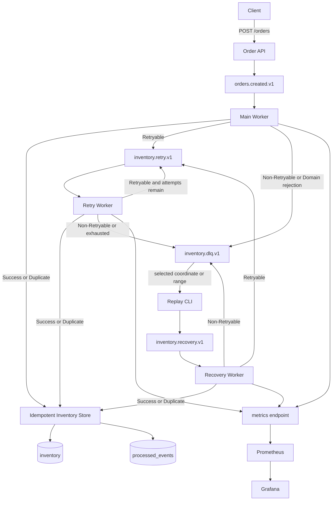

# Kafka Recovery Lab

Kafka의 at-least-once delivery에서 발생하는 Consumer 실패, 재전달, Retry 집중, DLQ 복구와 대량 Replay 부하를 실제 Kafka·MySQL 장애 실험으로 검증한 Go 프로젝트다. 정상 주문 서비스의 기능 확장보다 실패 경계와 복구 정책을 작은 환경에서 분리해 측정하는 데 초점을 맞췄다.

## Why This Project

기존 티켓 예매 프로젝트에서는 Consumer 실패 메시지를 DLQ로 격리했지만, DLQ 발행만으로 비즈니스 복구가 끝나는지와 DB commit 이후 Kafka offset commit 전에 장애가 나면 어떤 상태가 남는지는 충분히 검증하지 못했다.

이 프로젝트에서는 그 경계를 직접 중단해 중복 side effect를 재현하고, Retryable/Non-Retryable 분류, Backoff와 Jitter, MySQL idempotency, DLQ Replay, Recovery rate control 순서로 해결 범위를 확장했다. 각 결론은 application log만이 아니라 Kafka offset과 MySQL 상태를 교차 확인해 각 Phase 상세 문서에 정리했다.

## Core Goal

> **메시지는 재전달될 수 있지만, 재고 반영은 중복되지 않고, 재시도와 복구 부하는 통제된다.**

Kafka와 MySQL을 하나의 exactly-once transaction으로 묶지 않는다. Kafka는 at-least-once로 처리하고, MySQL에서는 `eventId` 기반 `processed_events` 등록과 `inventory` 변경을 같은 InnoDB transaction에 넣어 재전달의 비즈니스 side effect를 멱등하게 만든다.

## Architecture



Retry/DLQ/Recovery destination 발행이 성공한 뒤 source offset을 commit한다. 이 두 Kafka 작업도 원자적이지 않으므로 commit 경계에서 destination duplicate가 생길 수 있으며, 최종 DB side effect는 idempotency로 보호한다.

## Tech Stack

| 기술 | 이 프로젝트에서의 역할 |
| --- | --- |
| Go 1.26.5 | 표준 `net/http`, `database/sql`, `log/slog` 기반 API·Worker·CLI |
| Kafka 4.2.0 | 주문, Retry, DLQ와 Recovery record 저장; 단일 노드 KRaft 실험 환경 |
| `segmentio/kafka-go` v0.4.51 | 수동 fetch/commit, record/header 처리와 좌표 기반 Replay |
| MySQL 8.4.8 | InnoDB 재고 변경과 `processed_events`의 transactional idempotency |
| Docker Compose | Kafka, MySQL, Prometheus와 Grafana의 재현 가능한 로컬 실행 |
| Prometheus / Grafana | bounded-label Worker metric 수집과 9-panel dashboard |

## Key Results

### Commit boundary and idempotency

| 상태 | 첫 처리 | DB commit 후 offset commit 전 crash | 동일 record 재전달 |
| --- | ---: | --- | ---: |
| Phase 2 — idempotency 없음 | 100 → 98 | Kafka offset 미commit | **98 → 96** |
| Phase 5 — idempotency 적용 | 100 → 98 | Kafka offset 미commit | **98 → 98** |

Phase 2에서는 같은 topic/partition/offset과 eventId가 다시 전달되어 재고가 두 번 감소했다. Phase 5에서는 동일 eventId의 canonical payload를 Duplicate로 판정해 offset은 진행하되 추가 inventory update는 실행하지 않았다.

### Repeated Retry comparison

Phase 9에서 Phase 4 Scenario A의 60-event burst를 전략별 3회 반복했다.

| 전략 | Common 8s Retry median | Success | DLQ | 해석 |
| --- | ---: | ---: | ---: | --- |
| Fixed | 300 | 0 | 60 | 짧은 간격으로 Retry를 소진했다. |
| Exponential | 180 | 60 | 0 | Retry 수를 줄이고 전부 복구했다. |
| Full Jitter | 172 | 60 | 0 | Retry 분산은 있었지만 FIFO Worker의 HOL과 수초 overdue가 반복됐다. |

낮은 peak만으로 전략을 평가하지 않는다. Retry 횟수, 성공/DLQ, DB healthy 이후 recovery, overdue와 head-of-line blocking을 함께 비교했다.

### Bulk Recovery rate control

120건 backlog를 먼저 만든 뒤 Recovery Worker를 20/s로 제한한 Phase 9 반복 결과다.

| 항목 | Median |
| --- | ---: |
| Replay publication | 약 84.32 records/s |
| Recovery processing | 약 19.75 records/s |
| Processing peak | 20 records/s |
| Peak lag | 120 records |
| Replay CLI completion | 약 1.9초 |
| Business recovery completion | 약 8.0초 |

Replay publication 완료와 DB business recovery 완료는 다른 상태다. Publication limiter는 Recovery Topic 유입을, Recovery limiter는 backlog가 이미 있어도 최초 Store 진입 속도를 각각 통제한다.

### Observability

Main, Retry와 Recovery Worker의 Prometheus target이 모두 UP인 상태에서 Retry, DLQ, Duplicate, Recovery와 limiter wait metric의 실제 증가를 Kafka/MySQL 결과와 대조했다. Grafana는 Compose에서 datasource와 9개 panel을 자동 provision하며 10개 PromQL query를 검증했다. 정확한 committed consumer-group lag collector는 구현하지 않았다.

## Development Journey

### Phase 0 — Reproducible Environment

단일 KRaft Kafka와 InnoDB MySQL을 Compose로 구성하고 healthcheck, volume, 명시적 topic 생성, 실제 produce/consume와 DB 재시작 후 데이터 보존을 검증했다.

→ [Phase 0 상세 문서](docs/phase-0-environment.md)

### Phase 1 — Normal Order-to-Inventory Flow

`POST /orders → orders.created.v1 → Inventory Worker → MySQL → offset commit` 정상 경로를 만들었다. Worker는 `FetchMessage`로 읽고 DB 성공 이후에만 `CommitMessages`를 호출한다.

→ [Phase 1 상세 문서](docs/phase-1-normal-flow.md)

### Phase 2 — Kafka/MySQL Failure Boundaries

DB 작업 전 실패, commit 전 crash, DB commit 후 offset commit 전 crash와 poison message를 결정적으로 재현했다. 이 단계에서 idempotency가 없는 재전달은 재고를 `100 → 98 → 96`으로 중복 감소시켰다.

→ [Phase 2 상세 문서](docs/phase-2-failure-boundaries.md)

### Phase 3 — Error Classification, Fixed Retry and DLQ

일시 DB 오류만 Retry하고 계약 위반과 Domain rejection은 DLQ로 격리했다. destination 발행 실패 시 source offset을 남기며, poison message 뒤의 정상 record가 진행되는 것을 확인했다.

→ [Phase 3 상세 문서](docs/phase-3-retry-dlq.md)

### Phase 4 — Retry Storm, Backoff and Full Jitter

실제 MySQL 중단 중 Fixed, Exponential과 Full Jitter를 burst·지속 유입에서 비교했다. Retry RPS, lag, recovery, overdue와 FIFO Retry Worker의 HOL을 raw timestamp로 측정했다.

→ [Phase 4 상세 문서](docs/phase-4-backoff-jitter.md)

### Phase 5 — Idempotent Consumer

`processed_events` 등록과 `inventory` 차감을 같은 transaction으로 묶었다. DB commit 뒤 crash와 재전달에서도 재고가 `100 → 98 → 98`을 유지했고, 같은 eventId의 다른 payload는 conflict로 격리했다.

→ [Phase 5 상세 문서](docs/phase-5-idempotency.md)

### Phase 6 — DLQ Replay and Recovery

운영자가 지정한 DLQ record 한 건을 group offset 변경 없이 Recovery Topic으로 발행하는 CLI를 추가했다. Recovery Worker가 기존 Store와 Retry/DLQ 정책으로 실제 DB 상태를 복구하고 반복 Replay는 Duplicate로 처리했다.

→ [Phase 6 상세 문서](docs/phase-6-dlq-recovery.md)

### Phase 7 — Bulk Replay and Recovery Rate Limiting

한 partition의 DLQ 범위를 Bulk Replay하고 publication pacing과 Recovery Store 진입 pacing을 분리했다. Unlimited, Publication Limited와 기존 backlog의 Recovery Limited를 120건으로 비교했다.

→ [Phase 7 상세 문서](docs/phase-7-replay-rate-limit.md)

### Phase 8 — Prometheus and Grafana Observability

고카디널리티 event 식별자를 제외한 Worker metric을 노출했다. 세 Worker target, 실제 metric 변화, Grafana provisioning과 panel query를 Kafka/MySQL 상태와 함께 검증했다.

→ [Phase 8 상세 문서](docs/phase-8-observability.md)

### Phase 9 — Repeated Experiment Validation

Phase 4의 6개 cell과 Phase 7의 3개 cell을 각각 3회 반복하고 median/min/max를 집계했다. 반복된 경향과 scheduler, container startup, Jitter seed에 민감한 수치를 구분해 단일 run의 일반화 범위를 제한했다.

→ [Phase 9 상세 문서](docs/phase-9-repeated-experiments.md)

## Repository Structure

```text
.
├── cmd/          # API, Worker, Replay와 smoke 실행 진입점
├── internal/     # event, inventory, retry, rate limit와 observability 구현
├── migrations/   # inventory와 processed_events schema
├── monitoring/   # Prometheus/Grafana provisioning
├── scripts/      # 환경 준비와 기본 검증
├── tests/        # 실제 Kafka/MySQL integration harness
├── docs/         # Phase 0~9 상세 문서
├── .env.example
├── .gitignore
├── compose.yaml
├── go.mod
├── go.sum
└── README.md
```

## How to Run

### Prerequisites

- Go 1.26.5
- Docker Desktop와 Docker Compose
- PowerShell 7 또는 Windows PowerShell

프로젝트 루트에서 로컬 전용 `.env`를 만들고 infrastructure, topic과 schema를 준비한다. 생성된 `.env`는 Git에서 제외되며 password는 출력하지 않는다.

```powershell
. ./scripts/env.ps1 -Init
go mod download
docker compose up -d --wait
$topics = @(
  @{ Name = 'orders.created.v1'; Partitions = 6 },
  @{ Name = 'inventory.retry.v1'; Partitions = 1 },
  @{ Name = 'inventory.dlq.v1'; Partitions = 1 },
  @{ Name = 'inventory.recovery.v1'; Partitions = 1 }
)
foreach ($topic in $topics) {
  docker compose exec -T kafka /opt/kafka/bin/kafka-topics.sh --bootstrap-server kafka:19092 --create --if-not-exists --topic $topic.Name --partitions $topic.Partitions --replication-factor 1 --config cleanup.policy=delete --config retention.ms=604800000
  if ($LASTEXITCODE -ne 0) { throw "Topic creation failed: $($topic.Name)" }
}
powershell -NoProfile -ExecutionPolicy Bypass -File scripts/init-inventory.ps1 -Seed
```

별도 터미널에서 Main Worker와 API를 실행한다.

```powershell
. ./scripts/env.ps1
go run ./cmd/worker -metrics-address :22112
```

```powershell
. ./scripts/env.ps1
go run ./cmd/api
```

정상 주문을 발행한다.

```powershell
Invoke-RestMethod -Method Post -Uri http://127.0.0.1:8080/orders `
  -ContentType application/json -Body '{"productId":1,"quantity":1}'
```

MySQL에서 재고와 idempotency marker를 확인한다.

```powershell
docker compose exec -T mysql sh -c 'MYSQL_PWD="$MYSQL_PASSWORD" mysql --protocol=TCP --host=127.0.0.1 --user="$MYSQL_USER" --database="$MYSQL_DATABASE" -e "SELECT * FROM inventory WHERE product_id=1; SELECT event_id, processed_at FROM processed_events ORDER BY processed_at DESC LIMIT 5;"'
```

Retry와 Recovery process, 단건 Replay, 관측 UI는 필요할 때 추가한다.

```powershell
go run ./cmd/worker -retry-worker -metrics-address :22113
go run ./cmd/worker -recovery-worker -metrics-address :22114
go run ./cmd/replay -dlq-topic inventory.dlq.v1 -partition 0 -offset 0 -recovery-topic inventory.recovery.v1
```

- Prometheus: <http://127.0.0.1:9090>
- Grafana: <http://127.0.0.1:3000>

장애 실험은 실제 MySQL 컨테이너를 중단한다. 실행 절차, 격리 조건과 결과는 각 Phase 상세 문서에 기록했다.

## Verification

- 실제 Kafka/MySQL integration scenario를 tests/integration에 구현했다.
- DB 상태, Kafka offset과 Consumer 처리 결과를 교차 확인했다.
- Phase 9에서 핵심 Retry/Recovery 실험을 반복 실행했다.
- 각 Phase 상세 문서의 실행 및 검증 절에 결과와 한계를 기록했다.
- 기본 빌드 검증: powershell -NoProfile -ExecutionPolicy Bypass -File scripts/verify.ps1 -Check Build

→ [Documentation Index](docs/README.md)

## Known Limitations

- Kafka와 MySQL을 하나의 exactly-once transaction으로 묶지 않는다.
- destination Kafka publish와 source offset commit은 원자적이지 않아 destination duplicate와 처리 비용이 남을 수 있다.
- 단일 FIFO Retry Worker가 미래 예약 record를 기다려 뒤의 due record를 막는 HOL이 있다.
- Bulk Replay는 persistent checkpoint/resume와 multi-partition scheduling을 지원하지 않는다.
- Recovery limiter는 Recovery Topic에서 최초 Store 진입만 제한하며 이후 Retry lineage 전체 quota를 통제하지 않는다.
- exact committed consumer-group lag metric은 구현하지 않았다.
- 실험은 단일 broker, 단일 partition/Worker 중심의 Windows 로컬 Docker 환경에서 수행했다.
- Phase 9의 n=3은 편차 관측이며 production benchmark, 통계적 유의성이나 SLA 근거가 아니다.

더 세부적인 실패 조건, 측정 정의와 해석 한계는 [문서 인덱스](docs/README.md)에 연결된 Phase별 문서에 기록되어 있다.
