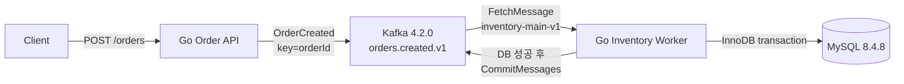

# kafka-recovery-lab

Kafka 메시지는 재전달될 수 있다는 전제에서, 재고 반영의 중복을 막고 재시도·복구 부하를 통제하는 과정을 단계별 실험으로 증명하는 Go 프로젝트다.

기존 티켓 예매 프로젝트에서 단순 DLQ 처리 후 남았던 질문에서 출발했다. 현재 Phase 4에서 Fixed Retry, Exponential Backoff, Full Jitter의 실제 장애 중 시도 집중과 복구를 비교했다. 예약 분산이 FIFO 대기 때문에 실제 실행 분산으로 그대로 이어지지 않는 것도 측정했다. Idempotency와 Replay는 아직 없으며, Phase 2에서 확인한 DB commit 후 Kafka offset commit 전 crash의 재고 **100 → 98 → 96** 중복 차감도 해결하지 않은 상태다.

## Architecture



| 구성 | 선택 |
| --- | --- |
| Go | 1.26.5, 표준 `net/http`, `database/sql`, `log/slog` |
| Kafka client | `github.com/segmentio/kafka-go` v0.4.51 |
| MySQL driver | `github.com/go-sql-driver/mysql` v1.10.0 |
| Local infrastructure | Docker Compose, 단일 KRaft Kafka, InnoDB MySQL |

## Development Journey

### Phase 0 — Reproducible Environment

문제: 장애 실험 전에 Kafka·MySQL의 실행과 데이터 영속성을 같은 조건으로 반복할 기준선이 필요했다.

구현·검증: 단일 KRaft broker와 InnoDB MySQL을 Compose로 구성하고 healthcheck, named volume, 명시적 topic 생성, Kafka 실제 produce/consume, SQL, MySQL 재시작 검사를 자동화했다.

핵심 결과: 사용자 검증 14개가 모두 PASS했고, Kafka 4.2.0과 MySQL 8.4.8 환경에서 메시지 왕복과 재시작 후 probe row 보존을 확인했다.

[Phase 0 상세 문서](docs/phase-0-environment.md) · [원시 검증 보고서](docs/phase-0-verification.md)

### Phase 1 — Normal Order-to-Inventory Flow

문제: 장애 경계를 판단하려면 DB transaction과 Kafka offset commit 순서가 분명한 정상 흐름이 먼저 필요했다.

구현·검증: `POST /orders → OrderCreated → orders.created.v1 → Inventory Worker → MySQL → CommitMessages`를 구현했다. `FetchMessage`로 읽고 DB commit 성공 후에만 offset을 수동 commit한다.

핵심 결과: 정상 요청 7건의 quantity 합계 19가 재고 100→81로 반영됐다. 잘못된 요청 5건은 Kafka에 발행되지 않았고, 정상 Worker 재시작 후 추가 처리는 0건이었다.

[Phase 1 상세 문서](docs/phase-1-normal-flow.md) · [원시 검증 보고서](docs/phase-1-verification.md) · [Evidence](docs/phase-1-evidence.json)

### Phase 2 — Kafka/MySQL Failure Boundaries

문제: MySQL commit과 Kafka offset commit은 원자적이지 않으며, 영구 실패 record를 격리할 정책도 없었다.

구현·검증: 특정 eventId에서만 동작하는 최소 fault hook으로 MySQL 장애, DB commit 전 crash, DB commit 후 crash, poison message를 실제 Worker 프로세스에서 재현했다. DB와 broker 상태는 Worker 밖에서 교차 확인했다.

핵심 결과:

- DB commit 전 crash: transaction rollback, offset 미commit, 동일 record 재전달
- DB commit 후 offset commit 전 crash: 동일 eventId 재전달과 재고 100→98→96 중복 반영
- Poison message: 두 번의 Worker 실행에서 같은 record가 실패하고 같은 partition의 정상 후속 record가 처리되지 않음

[Phase 2 상세 문서](docs/phase-2-failure-boundaries.md) · [원시 검증 보고서](docs/phase-2-verification.md) · [Evidence](docs/phase-2-evidence.json)

### Phase 3 — Fixed Retry / DLQ

문제: 일시 DB 장애와 영구 오류가 모두 Worker를 중단해 같은 partition의 정상 record까지 막았다.

선택·검증: 알려진 일시 DB 오류만 최대 3회 추가 Retry하고, 계약 위반과 Domain rejection은 DLQ로 격리했다. 알 수 없는 오류와 목적지 발행 실패는 source offset을 남긴다. Retry Worker는 동일 재고 함수를 사용하고 Header의 next-attempt-at까지 기다린다.

핵심 결과: Poison O0를 DLQ로 옮긴 뒤 Normal O1이 처리됐다. 복구 시 Retry 1회로 재고 100→98, 지속 장애 시 추가 Retry 1→2→3 후 DLQ, Retry/DLQ 발행 실패 시 source 미commit을 확인했다.

[Phase 3 상세 문서](docs/phase-3-retry-dlq.md) · [검증 보고서](docs/phase-3-verification.md) · [Evidence](docs/phase-3-evidence.json)

### Phase 4 — Retry Storm / Backoff / Full Jitter

문제: 실패 record를 Retry로 넘기는 것만으로 재시도 집중과 복구 부하가 통제되는지는 알 수 없었다.

선택·검증: 기존 Worker와 재고 함수를 유지하고 지연 전략만 확장했다. 실제 MySQL을 중단하며 동시 60건과 5건/초 지속 유입을 각각 비교했다. Header 예약 시각, 실제 시도, 초당 횟수, lag, SQL 재고, DLQ를 원시 기록으로 대조했다.

핵심 결과: 지속 유입의 전체 peak는 Jitter 39회/초, Exponential 35회/초로 Jitter가 항상 더 낮지는 않았다. 최초 8초 공통 장애 구간에서는 둘 다 15회/초였다. 예약 초과 지연과 HOL을 함께 측정했으며, DB 재기동 시간이 긴 첫 실행은 원본을 보존하고 비교 셀을 다시 실행했다. 전체 복구 수치는 실제 장애 길이 편차를 포함한 단일 실행 관측이다.

[Phase 4 상세 문서](docs/phase-4-backoff-jitter.md) · [검증 보고서](docs/phase-4-verification.md) · [Evidence](docs/phase-4-evidence.json) · [원시 실행](experiments/phase4/)

## Run locally

프로젝트 루트 PowerShell에서 실행한다.

```powershell
. ./scripts/env.ps1 -Init
go mod download
docker compose up -d --wait
powershell -NoProfile -ExecutionPolicy Bypass -File scripts/verify.ps1 -Check Topics
powershell -NoProfile -ExecutionPolicy Bypass -File scripts/verify-phase3.ps1 -Check Topics
powershell -NoProfile -ExecutionPolicy Bypass -File scripts/init-inventory.ps1 -Seed
```

`-Seed`는 product 1을 100으로 되돌린다. 기존 검증 데이터가 있는 환경에서는 생략하고, 활성 Worker나 미처리 record가 없는 초기 로컬 환경에서만 사용한다.

별도 터미널에서 Main Worker, Retry Worker와 API를 실행한다.

```powershell
. ./scripts/env.ps1
go run ./cmd/worker
```

```powershell
. ./scripts/env.ps1
go run ./cmd/worker -retry-worker
```

기본 group은 main `inventory-main-v1`, retry `inventory-retry-v1`이다. 환경 변수 `KAFKA_CONSUMER_GROUP`을 사용하면 각 프로세스에 서로 다른 group을 지정한다. 기본 추가 Retry는 3회, Fixed Delay는 2초다.

```powershell
. ./scripts/env.ps1
go run ./cmd/api
```

```powershell
Invoke-RestMethod -Method Post -Uri http://127.0.0.1:8080/orders `
  -ContentType application/json -Body '{"productId":1,"quantity":1}'
```

## Verification

```powershell
# Phase 0 environment
powershell -NoProfile -ExecutionPolicy Bypass -File scripts/verify.ps1 -Check All

# Phase 1 normal flow and earlier regression
powershell -NoProfile -ExecutionPolicy Bypass -File scripts/verify-phase1.ps1 -Check All

# Phase 2 failure scenarios and earlier regressions
powershell -NoProfile -ExecutionPolicy Bypass -File scripts/verify-phase2.ps1 -Check All

# Phase 3 plus all prior regressions
powershell -NoProfile -ExecutionPolicy Bypass -File scripts/verify-phase3.ps1 -Check All

# Phase 4 comparison, raw evidence audit and all prior regressions
powershell -NoProfile -ExecutionPolicy Bypass -File scripts/verify-phase4.ps1 -Check All
```

장애 검증은 공유 로컬 MySQL 컨테이너를 실제 중지하므로 다른 애플리케이션과 병행하지 않는다. 각 시나리오는 새 product, topic, group을 사용하며 기존 offset이나 inventory를 초기화하지 않는다. Phase 2 스크립트는 `-phase2-baseline`으로 과거 실패 동작을 명시적으로 재현하며 일반 Worker에는 이 옵션을 사용하지 않는다.

Phase 4 진입점은 Phase 0~3 회귀 evidence를 별도 경로에 저장하고 최종 Phase 4 evidence에 포함한다. Phase 1~3 스크립트를 직접 실행하면 해당 Phase evidence를 갱신하므로 역사적 기록을 보존하려면 Phase 4 진입점을 사용한다. Phase 4 raw 파일은 덮어쓰지 않으며 `-Check Audit`은 저장된 결과만 다시 계산한다.

## Current limits

- DB commit과 Kafka offset commit 사이의 중복 처리는 아직 해결하지 않았다.
- Retry/DLQ 발행 성공과 source commit 사이 crash는 목적지 중복 발행을 만들 수 있다.
- Retry 대기는 Worker의 다음 record 처리를 지연시키는 head-of-line blocking이 있다.
- 단일 broker/RF=1 로컬 환경이며 broker HA를 검증하지 않았다.
- Backoff/Jitter 비교는 단일 Worker/partition 구성과 각 비교 셀 1회 실행에 한정된다. 실제 DB 재기동 시간 편차와 HOL이 결과에 영향을 준다.
- 다중 Worker rebalance, 운영 규모 처리량, 반복 실험의 통계적 유의성, Replay 부하는 아직 검증하지 않았다.

앞으로 각 Phase는 코드·검증 완료, 원시 verification/evidence 보존, `docs/phase-N-*.md`의 동일한 11개 섹션 작성, Development Journey 갱신, 수치·링크 대조를 모두 마친 뒤 완료 commit을 만든다.
