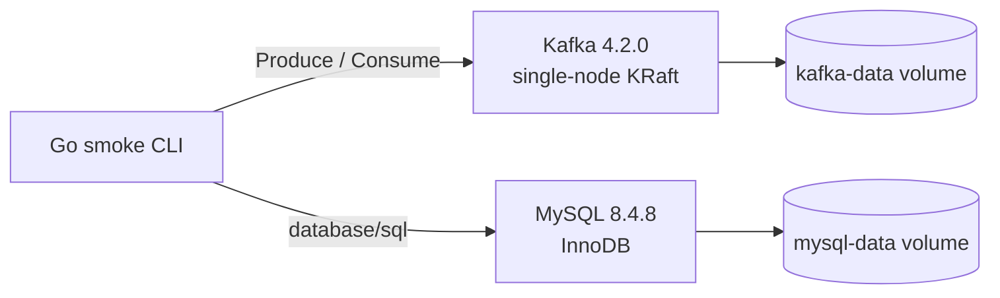

# Phase 0 - 재현 가능한 Kafka·MySQL 로컬 환경

작성 기준: Phase 0 완료 commit `856f76148bc864084c1e6b57e5ccd5eadf89fdd3`, 기존 검증 보고서와 현재까지 보존된 코드.

## 1. 목표

장애 복구 로직을 논하기 전에 누구나 같은 Kafka와 MySQL 환경을 다시 띄우고 연결을 검증할 수 있어야 했다. Phase 0의 목표는 Go 애플리케이션이 단일 Kafka broker와 MySQL에 연결해 실제 메시지 왕복과 SQL 실행을 수행하며, 컨테이너 재시작 뒤에도 DB 데이터가 유지되는 최소 기준선을 만드는 것이었다.

이 단계에서는 주문, 재고, Retry, DLQ, Idempotency 같은 비즈니스·복구 기능을 만들지 않았다.

## 2. 배경 개념

- **KRaft**: Kafka가 ZooKeeper 없이 controller metadata를 관리하는 방식이다. 로컬 장애 실험의 초점은 broker HA가 아니므로 broker와 controller 역할을 한 노드에 배치했다.
- **명시적 topic 생성**: `auto.create.topics.enable=false`로 두고 검증 스크립트가 topic 이름, partition 수, replication factor, retention을 확인한다.
- **InnoDB와 named volume**: transaction과 컨테이너 수명 밖의 데이터 보존을 위한 기반이다.
- **database/sql driver**: Go 표준 `database/sql`은 공통 API만 제공하므로 MySQL wire protocol 구현인 `go-sql-driver/mysql`이 필요하다.

## 3. 왜 필요한가

Kafka 연결, topic 설정, MySQL engine과 데이터 영속성이 매번 달라지면 이후 장애 실험의 결과가 애플리케이션 문제인지 환경 문제인지 구분하기 어렵다. 따라서 먼저 인프라 구성을 코드로 고정하고, 연결·메시지 왕복·SQL·재시작 영속성을 자동 검증했다.

이 기준선은 이후 Phase에서 같은 Go 1.26.5, Kafka 4.2.0, MySQL 8.4.8, `kafka-go` v0.4.51을 계속 사용하는 근거가 됐다.

## 4. 시스템 구조



Go 프로그램은 호스트에서 실행하고 Kafka와 MySQL만 Docker Compose로 실행한다. 두 포트는 로컬 loopback에만 공개한다.

## 5. 구현 과정

- `compose.yaml`: Kafka를 `broker,controller` 단일 KRaft 노드로 구성하고 MySQL 기본 engine을 InnoDB로 지정했다. 두 서비스에 healthcheck와 named volume을 설정했다.
- `scripts/env.ps1`: 제한된 `KEY=value` 형식으로 환경 변수를 읽으며, `.env`가 없을 때만 로컬 비밀번호를 생성한다. 실제 `.env`는 Git에서 제외한다.
- `scripts/verify.ps1`: 빌드, 인프라 상태, topic, Kafka, MySQL, 영속성 검사를 독립적으로 실행한다.
- `cmd/smoke/kafka.go`: 현재 tail offset 이후에 고유 key를 발행하고 동일 key와 payload를 소비한다. 과거 record가 검사를 잘못 통과시키지 않는다.
- `cmd/smoke/mysql.go`: `SELECT 1`, 서버 버전, 기본 engine을 확인하고 probe row를 저장·조회·정리한다.
- `internal/config/config.go`: broker와 DB 주소, 계정, timeout을 환경 변수에서 읽고 형식을 검증한다.

`orders.created.v1`은 6 partitions, `phase0.smoke.v1`은 1 partition으로 명시 생성했다. 두 topic 모두 RF=1, `cleanup.policy=delete`, 7일 retention을 사용했다.

## 6. 핵심 코드

```go
writer := &kafka.Writer{
    Addr: kafka.TCP(brokers...), Topic: smokeTopic,
    RequiredAcks: kafka.RequireAll, Async: false, MaxAttempts: 1,
    AllowAutoTopicCreation: false,
}
err = writer.WriteMessages(ctx, kafka.Message{Key: key, Value: value})
```

동기 발행, acks=all, 자동 topic 생성 금지를 명시한다. 이 코드는 업무 producer가 아니라 broker 연결과 실제 저장을 확인하는 transport probe다.

```go
if err := db.QueryRowContext(ctx,
    "SELECT 1, VERSION(), @@default_storage_engine",
).Scan(&one, &version, &engine); err != nil {
    return err
}
```

TCP 연결 성공만 확인하지 않고 실제 SQL 결과와 InnoDB 설정까지 확인한다. 별도의 ORM은 추가하지 않았다.

## 7. 실행 및 검증

```powershell
powershell -NoProfile -ExecutionPolicy Bypass -File scripts/verify.ps1 -Check All
```

| 검증 | 실제 결과 | 판정 |
| --- | --- | --- |
| Compose 서비스 | Kafka·MySQL running/healthy, 서비스 수 2 | PASS |
| Kafka 버전 | 4.2.0 | PASS |
| MySQL 버전·engine | 8.4.8, InnoDB | PASS |
| Topic | `orders.created.v1` 6 partitions, `phase0.smoke.v1` 1 partition | PASS |
| Kafka 왕복 | `phase0.smoke.v1` partition 0 / offset 0, key·payload 일치 | PASS |
| MySQL SQL | `SELECT 1` 결과 1 | PASS |
| MySQL 영속성 | probe `707be59fdadd4af0871046095ef4617b`를 재시작 전후 조회 후 1행 정리 | PASS |
| 전체 사용자 검증 항목 | PASS 14 / FAIL 0 / UNVERIFIED 0 | PASS |

원시 명령, 이미지 digest와 출력에 근거한 판정은 [Phase 0 검증 보고서](phase-0-verification.md)에 정리했다.

## 8. 발생한 문제

| 문제 | 원인 | 해결 |
| --- | --- | --- |
| Docker named pipe 연결 실패 | Docker Desktop engine 미기동 | Desktop을 실행하고 Linux engine 연결을 재확인 |
| `mysql:8.4.12` pull 실패 | 문서의 버전과 registry에서 실제 제공되는 tag가 달랐음 | 실제 manifest가 있는 8.4.8과 digest로 고정 |
| 초기 인프라 게이트 연쇄 실패 | 이미지 pull 실패로 컨테이너와 topic이 생성되지 않음 | 원인 수정 후 전체 검사 및 미완료 게이트 재실행 |
| Compose JSON 파싱 간헐 실패 | 실패 입력이 남지 않아 정확한 인코딩 원인은 확인 불가 | 전체 JSON 대신 `docker inspect --format`으로 필요한 ASCII 필드만 비교 |

마지막 문제는 추정 원인을 사실처럼 확정하지 않았다. Kafka의 점·밑줄 혼용 metric 경고도 숨기지 않았으며 현재 topic은 점만 사용한다.

## 9. 결과와 한계

증명한 것은 단일 로컬 KRaft broker와 InnoDB MySQL을 재현 가능하게 기동하고, 실제 Kafka produce/consume, SQL, MySQL 컨테이너 재시작 영속성이 동작한다는 점이다. 설정과 dependency 버전도 저장소에서 확인할 수 있다.

Broker HA, replication 장애 내구성, business consumer, Retry/DLQ, 주문·재고 schema는 증명하거나 구현하지 않았다. RF=1과 PLAINTEXT는 로컬 실험 비용을 줄이지만 운영 환경의 가용성·보안을 대표하지 않는다.

## 10. 배운 점

연결 가능 여부만으로는 이후 실험의 기준선이 되지 않는다. Kafka에서는 새 record의 좌표와 payload 일치, MySQL에서는 engine과 재시작 전후 동일 row를 확인해야 환경이 실제로 재현됐다고 말할 수 있었다. 또한 이미지 버전은 문서에 존재하는 표기보다 registry에서 pull 가능한 tag와 digest를 함께 확인해야 한다.

## 11. 다음 Phase와의 연결

인프라와 transport 검증이 안정됐으므로 Phase 1에서는 이 기반 위에 `POST /orders → OrderCreated → Kafka → Inventory Worker → MySQL → offset commit` 정상 흐름을 구현할 수 있었다. Phase 0은 복구 문제를 해결하지 않고 이후 비교가 가능한 공통 실행 환경만 제공한다.
