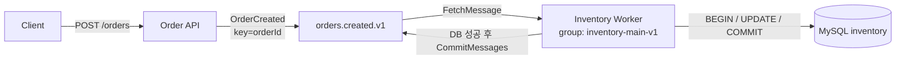

# Phase 1 - 주문 이벤트와 재고 처리 정상 흐름

작성 기준: Phase 1 완료 commit `0f4b730371998b0240aa922678589782fe14e7bd`, 기존 verification/evidence와 현재 코드. 현재 Consumer에는 Phase 2 hook이 추가됐지만 기본값은 nil이며 이 문서의 정상 경로는 유지된다.

## 1. 목표

장애를 재현하려면 먼저 정상 처리의 경계가 명확해야 한다. Phase 1에서는 HTTP 주문 요청을 Kafka 이벤트로 발행하고 Consumer가 InnoDB 재고를 차감한 뒤 offset을 commit하는 최소 정상 흐름을 구현했다.

목표는 주문 서비스의 기능 확장이 아니라 이후 장애 실험에서 비교할 기준선을 만드는 것이었다.

## 2. 배경 개념

- **202 Accepted**: Kafka 발행이 확인됐다는 의미다. 재고 반영 완료를 뜻하지 않는다.
- **Kafka key**: `orderId`를 key로 사용한다. 같은 주문의 partition 선택을 일관되게 하지만 멱등성을 제공하지는 않는다.
- **Consumer Group과 offset**: `inventory-main-v1`이 처리 진행 위치를 broker에 저장한다. committed offset은 처리한 record의 다음 위치다.
- **Manual commit**: `FetchMessage`로 읽고 DB 성공 후 `CommitMessages`를 호출한다.
- **조건부 원자 UPDATE**: `available_quantity >= quantity` 조건과 차감을 한 SQL 문에 둬 음수 재고와 read-modify-write 경쟁을 피한다.

## 3. 왜 필요한가

Phase 0은 Kafka와 MySQL을 연결했지만 업무 record의 생성, 처리, DB transaction과 Kafka commit 순서가 없었다. 이 상태에서는 장애가 어느 경계를 깨뜨렸는지 설명할 수 없다.

따라서 Phase 1에서 `DB commit 성공 → Kafka offset commit` 순서를 명시하고 정상 요청·잘못된 요청·정상 Worker 재시작을 실측했다. 이 선택은 실패 시 메시지를 잃지 않는 대신 DB commit과 offset commit 사이의 중복 가능성을 남긴다.

## 4. 시스템 구조



## 5. 구현 과정

- `internal/order/http.go`: JSON 크기·형식·양수 필드를 검증하고 동기 Kafka 발행 성공 후 202를 반환한다. 발행 실패는 503이며 결과가 불확실할 수 있음을 응답한다.
- `internal/event/order_created.go`: schemaVersion 1, UUID v4 eventId/orderId, 양수 productId/quantity, UTC createdAt 계약을 정의한다.
- `internal/kafka/client.go`: Producer는 Hash balancer, acks=all, 동기 발행, `MaxAttempts=1`을 사용한다. Consumer는 `CommitInterval=0`과 `FetchMessage`를 사용한다.
- `internal/inventory/consumer.go`: decode와 key 검증 후 DB 처리를 호출하고 성공했을 때만 offset을 commit한다. 실패하면 뒤 메시지로 진행하지 않고 Worker를 종료한다.
- `internal/inventory/store.go`: InnoDB transaction 안에서 조건부 UPDATE를 실행하고 정확히 1행일 때 commit한다.
- `tests/integration/phase1_test.go`: 실제 API와 Worker 자식 프로세스, broker offset, 독립 SQL 조회를 대조한다.

핵심 transaction 경계는 MySQL `tx.Commit()`과 Kafka `CommitMessages()` 사이에 있다. 두 호출은 하나의 원자적 transaction이 아니다.

## 6. 핵심 코드

```go
m, err := reader.FetchMessage(ctx)
// decode, key 검증
err = apply(dbCtx, e)
if err != nil {
    return fmt.Errorf("inventory processing: %w", err)
}
err = reader.CommitMessages(commitCtx, m)
```

DB 처리가 실패하면 offset commit을 호출하지 않는다. 반대로 DB가 성공한 뒤 프로세스가 종료되면 아직 commit되지 않은 같은 record가 다시 전달될 수 있다는 공백도 이 순서에 남는다.

```go
result, err := tx.ExecContext(ctx, `UPDATE inventory
    SET available_quantity = available_quantity - ?, updated_at = UTC_TIMESTAMP(6)
    WHERE product_id = ? AND available_quantity >= ?`,
    e.Quantity, e.ProductID, e.Quantity)
```

조회 후 애플리케이션에서 계산하지 않고 DB가 조건 검사와 차감을 한 문장으로 수행한다. `RowsAffected()==0`은 상품 없음 또는 재고 부족이지만, 이 Phase에서는 두 원인을 분류하지 않았다.

## 7. 실행 및 검증

```powershell
powershell -NoProfile -ExecutionPolicy Bypass -File scripts/verify-phase1.ps1 -Check Build
powershell -NoProfile -ExecutionPolicy Bypass -File scripts/verify-phase1.ps1 -Check Phase0
powershell -NoProfile -ExecutionPolicy Bypass -File scripts/verify-phase1.ps1 -Check Flow
```

| 검증 | 실제 결과 | 판정 |
| --- | --- | --- |
| 정상 HTTP | 7건 모두 202, Kafka event ID/key/quantity 일치 | PASS |
| 재고 | 초기 100, quantity `1+3+1+2+3+4+5=19`, 최종 81 | PASS |
| 잘못된 HTTP | 5건 모두 400, Kafka end/committed offset 불변 | PASS |
| DB 이후 commit | 로그 순서와 broker OffsetFetch로 각 record의 다음 offset 확인 | PASS |
| 정상 재시작 | Worker PID 3052 → 33184, Stable 가입 후 5초간 추가 처리 0 | PASS |
| 회귀·범위 | Phase 0 PASS, Retry/DLQ/Idempotency 없음 | PASS |

최종 committed/end는 partition 0 `3/3`, 1 `1/1`, 2 `2/2`, 3 `2/2`, 4 `-1/0`, 5 `-1/0`이었다. `-1`은 저장된 group offset이 없다는 실제 응답이다. 상세 record와 로그는 [Phase 1 evidence](phase-1-evidence.json), 판정과 명령은 [검증 보고서](phase-1-verification.md)에 보존했다.

## 8. 발생한 문제

| 문제 | 원인 | 해결 |
| --- | --- | --- |
| Group API의 `Not Coordinator` | bootstrap broker에 group 상태를 직접 조회 | `FindCoordinator`로 coordinator를 찾은 뒤 group API 실행 |
| kafka-go 오류 상수 compile 실패 | 사용한 버전의 실제 이름은 `GroupIdNotFound` | 고정된 v0.4.51 API 이름에 맞춰 수정하고 compile 확인 |
| 검증용 Reader 설정 누락 | `MinBytes=1`에 대응하는 `MaxBytes`를 지정하지 않음 | production Reader와 같은 `MaxBytes=1e6` 지정 |
| 검증 코드 오류 중 정상 record 1건이 남음 | 실패한 검증도 Kafka 발행 자체는 성공 | offset reset 없이 별도 정상 Worker로 처리하고 partition 3 offset 0·committed 1을 기록 |
| 로그 버퍼 동시 접근 가능성 | 자식 프로세스 로그 기록과 검증 읽기가 동시에 수행됨 | private buffer와 mutex 메서드만 노출하도록 수정 |

남은 record 1건을 최종 7건의 재고 수치에 섞지 않았다. topic 전체는 8건이지만 성공 시나리오 집계는 7건이다.

## 9. 결과와 한계

정상 입력이 Kafka와 MySQL에 일관되게 반영되고 DB 성공 후 offset이 commit되며, 정상 재시작 시 이미 commit한 record를 다시 처리하지 않는다는 점을 증명했다. 잘못된 HTTP 요청은 Kafka에 발행되지 않았다.

정상 재시작 0건은 모든 장애에서 중복이 없다는 보장이 아니다. Idempotency가 없고 DB commit과 Kafka commit도 원자적이지 않다. 한 record가 실패하면 Worker 전체가 종료되므로 poison message가 진행을 막을 수 있다. DB crash, 강제 종료, rebalance, 다중 Worker와 처리량은 이 Phase에서 증명하지 않았다.

## 10. 배운 점

Manual commit은 처리 전 offset이 이동하는 위험을 줄이지만 외부 DB side effect까지 exactly-once로 만들지는 않는다. 또한 `202 Accepted`와 inventory 반영을 분리해 설명해야 HTTP 성공을 최종 업무 완료로 오해하지 않는다. 정상 흐름의 성공만으로 장애 내구성을 추론할 수 없다는 검증 경계도 명확해졌다.

## 11. 다음 Phase와의 연결

`tx.Commit()` 성공 후 `CommitMessages()` 전에 Worker가 사라질 수 있다는 공백과 실패 record에서 Worker가 멈추는 한계가 남았다. Phase 2에서는 이 두 문제를 해결하지 않고 실제 장애로 재현해 Retry/DLQ와 Idempotency 설계의 before 증거를 만든다.
