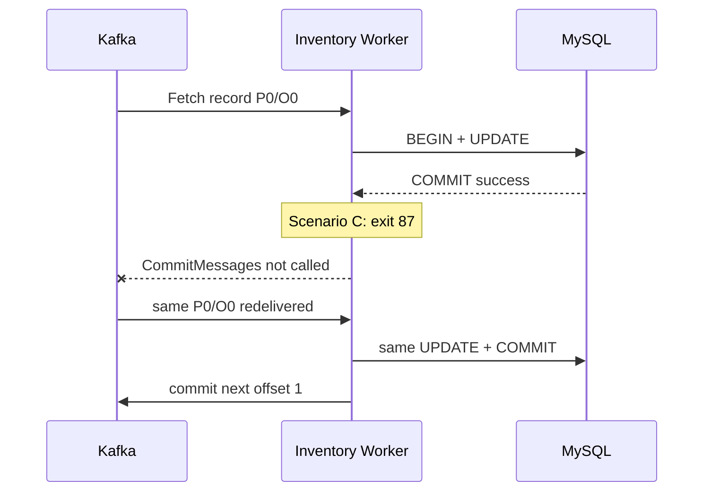

# Phase 2 - Kafka·MySQL 장애 경계 재현

작성 기준: Phase 2 완료 commit `a4f84f35224cc7952817443d1e3a2da8374ed771`, 기존 verification/evidence와 현재 코드.

## 1. 목표

기존 티켓 예매 프로젝트에서는 Consumer 실패 record를 DLQ로 격리했지만, MySQL commit과 Kafka offset commit 사이의 장애가 만드는 상태는 충분히 검증하지 않았다. Phase 2의 목표는 Phase 1 정상 흐름을 유지한 채 DB와 offset이 하나의 transaction이 아니라는 사실을 실제 장애와 외부 상태로 증명하는 것이었다.

이 단계의 완료 조건은 문제 해결이 아니라 DB 장애, commit 전후 crash, poison message를 결정적으로 재현하는 것이다.

## 2. 배경 개념

- **At-least-once delivery**: offset이 commit되기 전에는 같은 record가 다시 전달될 수 있다.
- **서로 다른 commit 경계**: MySQL `COMMIT`과 Kafka `OffsetCommit`은 별도 시스템의 독립 연산이다. Kafka Transaction도 이 프로젝트의 외부 MySQL transaction을 자동으로 원자화하지 않는다.
- **Crash window**: DB commit은 끝났지만 offset commit은 시작하지 않은 구간이다. 재전달되면 DB side effect가 다시 실행될 수 있다.
- **Poison message**: 재시도해도 형식 자체가 바뀌지 않는 영구 실패 record다. 격리 정책이 없으면 같은 partition의 진행 위치를 막는다.

## 3. 왜 필요한가

Phase 1은 DB 성공 후 offset을 commit하므로 DB 실패 시 메시지를 잃지 않는다. 그러나 그 순서만으로는 DB 성공과 offset commit 사이의 process crash를 해결할 수 없다. 또한 모든 실패에서 Worker가 종료되므로 일시 장애와 영구 오류가 같은 결과를 만든다.

예상만으로 Retry, DLQ, Idempotency를 설계하면 해결책의 필요성과 효과를 수치로 비교할 수 없다. 그래서 먼저 동일 record 좌표, DB 재고, broker committed offset을 장애 전후에 교차 측정했다.

## 4. 시스템 구조



Scenario별 새 product, 단일 partition topic, consumer group을 사용했다. 기존 offset reset이나 재고 복원으로 결과를 만들지 않았다.

## 5. 구현 과정

- `internal/inventory/consumer.go`: decode 전 topic/partition/offset와 payload SHA-256을 기록하고 `BeforeDB`, `AfterCommit` 경계를 호출한다.
- `internal/inventory/store.go`: 조건부 UPDATE 성공 후 `tx.Commit()` 직전에 `BeforeCommit` 경계를 호출한다.
- `internal/fault/hooks.go`: 특정 eventId 하나에만 `before-db`, `before-db-commit`, `after-db-commit` 동작을 연결한다. 기본 실행은 모든 hook이 nil이다.
- `cmd/worker/main.go`: 실험용 CLI에서 fault 지점·eventId·격리 topic을 받는다. fault 설정은 이벤트 payload와 분리했다.
- `tests/integration/phase2_test.go`: 실제 Worker 프로세스를 종료시키고 Worker 밖에서 SQL과 Kafka broker API로 상태를 측정한다.
- `scripts/verify-phase2.ps1`: Build, Phase 0·1 Regression, A~D를 순차 실행한다.

`before-db-commit`은 exit 86, `after-db-commit`은 exit 87로 Go defer를 우회한다. 범용 fault framework나 업무 retry loop는 추가하지 않았다.

## 6. 핵심 코드

```go
case "before-db-commit":
    os.Exit(86)
case "after-db-commit":
    os.Exit(87)
```

외부에서 적당한 시점에 kill하는 대신 코드 경계에 도달했을 때만 종료한다. B에서는 열린 MySQL transaction의 연결 종료 rollback을, C에서는 이미 끝난 DB commit과 실행되지 않은 Kafka commit을 결정적으로 분리한다.

```go
log.Info("inventory_committed")
if hooks.AfterCommit != nil {
    if err := hooks.AfterCommit(ctx, e); err != nil {
        return err
    }
}
err = reader.CommitMessages(commitCtx, m)
```

Scenario C hook은 `apply`가 성공해 DB commit이 끝난 후, `CommitMessages`보다 앞에 있다. 기본 hook이 nil이면 Phase 1과 같은 경로를 따른다.

## 7. 실행 및 검증

```powershell
powershell -NoProfile -ExecutionPolicy Bypass -File scripts/verify-phase2.ps1 -Check All
```

| Scenario | 장애 직후 | 재시작 후 | 판정 |
| --- | --- | --- | --- |
| A — MySQL 장애 | DB 처리 실패, inventory는 복구 직후 100, committed `-1` | 같은 P0/O0 재전달, inventory 98, committed 1 | PASS |
| B — DB commit 전 crash | exit 86, inventory 100, committed `-1` | 같은 P0/O0 재전달, inventory 98, committed 1 | PASS |
| C — DB commit 후 Kafka commit 전 crash | exit 87, inventory 98, committed `-1` | 같은 eventId/P0/O0 재전달, inventory 96, committed 1 | PASS |
| D — Poison | schemaVersion 2가 두 Worker에서 exit 1, inventory 100, committed `-1` | P0/O1 정상 후속 record 미처리, end 2 | PASS |

A~D의 fault record는 quantity 2, partition 0, offset 0이었다. A~C의 end offset은 0→1, D는 poison과 정상 후속 record로 0→2였다. Phase 0 회귀와 Phase 1 정상 흐름 회귀도 PASS했으며 최종 완료 조건은 PASS 16 / FAIL 0 / UNVERIFIED 0이다.

Scenario C의 실제 상태 변화가 핵심 증거다.

```text
inventory:        100 → 98 → 96
committed offset:  -1 → -1 → 1
record:           동일 topic / partition 0 / offset 0 / eventId
```

원시 eventId, productId, PID, record hash와 로그는 Phase 2 evidence, 명령·외부 CLI 교차 확인은 [검증 보고서](phase-2-verification.md)에 있다.

## 8. 발생한 문제

| 문제 | 원인 | 해결 |
| --- | --- | --- |
| 재개 시 Docker engine 연결 실패 | Docker Desktop Linux engine 미기동 | 기존 volume을 유지한 채 engine과 서비스를 기동 |
| PowerShell build tag 구문 오류 | 쉼표가 있는 `-tags=integration,phase2`가 인수 목록으로 파싱됨 | 전체 tag 인수를 따옴표로 감쌈 |
| 최초 A 검증 FAIL | 실제 MySQL 중단으로 관측용 DB pool의 연결도 끊겨 복구 후 `invalid connection` 발생 | Worker 동작은 바꾸지 않고 외부 관측기만 새 DB 연결을 열도록 수정 |

최초 A는 Worker의 DB 실패와 미commit까지 성공적으로 관측했지만 이후 검증이 중단됐으므로 PASS로 바꾸지 않았다. evidence에는 Scenario 실행 기록 **PASS 8 / FAIL 1 / UNVERIFIED 0**이 누적되어 있고, FAIL 1과 이후 독립 실행의 PASS를 함께 보존한다.

## 9. 결과와 한계

증명한 것:

- MySQL 사용 불가 또는 DB commit 전 crash에서는 DB 변경과 offset commit이 남지 않고 같은 record가 재전달된다.
- DB commit 후 offset commit 전 crash에서는 DB 변경만 남고 같은 record가 재전달되어 동일 eventId의 side effect가 두 번 실행된다.
- 영구 실패 record는 commit되지 않아 Worker 재시작 뒤에도 반복되고 같은 partition 후속 record를 막는다.

증명하지 않은 것:

- Retry/DLQ/Idempotency로 문제가 해결되는지
- 다중 Worker rebalance, 다중 partition 장애 상호작용, broker HA
- end-to-end exactly-once와 부하·처리량 개선

각 Scenario의 단일 partition 격리는 좌표 비교를 결정적으로 만들지만 실제 다중 partition 운용 전체를 대표하지 않는다. 실험 topic과 poison record가 retention 기간 동안 남는 저장 비용도 있다.

## 10. 배운 점

Manual offset commit은 메시지 유실을 피하기 위한 필요 조건이지 외부 DB의 exactly-once 조건이 아니다. `DB COMMIT 성공` 로그만으로 처리가 완결됐다고 볼 수 없으며 같은 시점의 broker committed offset을 함께 봐야 한다. 또한 실패 record를 계속 재전달하는 것만으로 복구가 되지 않으며, 영구 오류는 진행 자체를 막는다는 점을 실제 후속 record로 확인했다.

## 11. 다음 Phase와의 연결

Poison message의 반복과 진행 차단은 Phase 3에서 Retryable/Non-Retryable 분류와 DLQ 격리가 필요한 직접 근거다. Scenario C의 100→98→96은 이후 MySQL 기반 Idempotency를 적용했을 때 동일 이벤트의 두 번째 side effect를 차단하는지 비교할 before 값이다. Retry Storm, Backoff, Jitter, Replay와 Rate Limiting은 각각의 후속 Phase에서 별도로 검증하며 Phase 2에는 포함하지 않았다.
