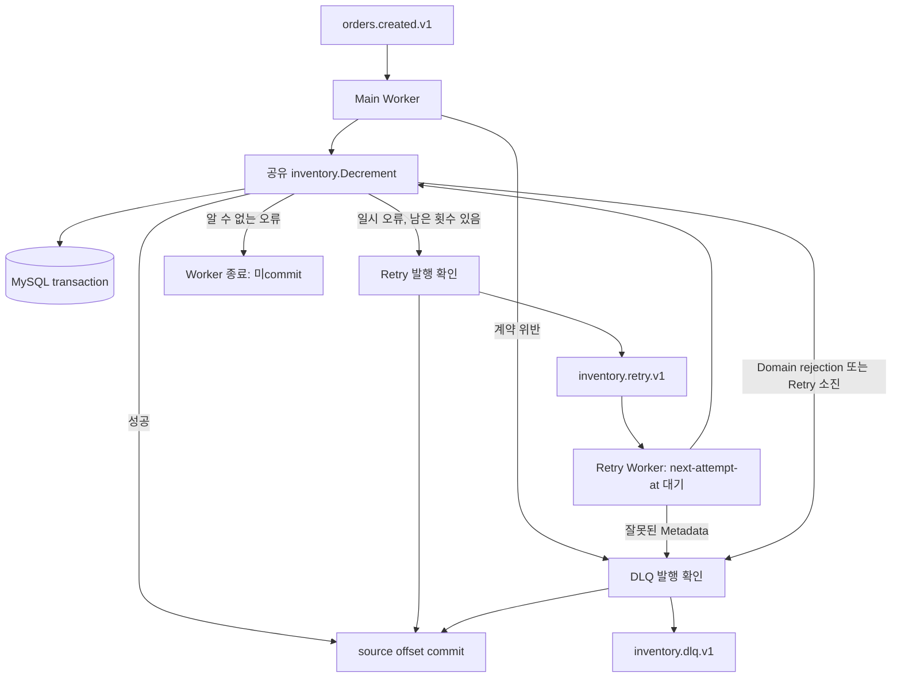

# Phase 3 - Fixed Retry와 DLQ로 실패 메시지 진행 차단 해소

## 1. 목표

Phase 2에서 poison record 하나가 같은 partition의 뒤 정상 record를 막는 것을 확인했다. 이번에는 실패 원인에 따라 처리 경로를 나누고, 실패 record를 안전하게 다음 topic으로 넘긴 뒤 source offset을 진행시키기로 했다. 정상 처리와 재고 transaction은 그대로 재사용했다.

## 2. 배경 개념

Retry topic은 일시 장애로 실패한 원본을 나중에 다시 처리하기 위한 Kafka topic이다. DLQ는 지금 정책으로 처리하지 않을 원본과 실패 정보를 보존한다. 둘 다 발행 성공이 확인된 뒤에만 source offset을 commit해야 전송 실패 때문에 record를 건너뛰지 않는다.

Retry 횟수는 최초 처리 0과 추가 처리 1·2·3으로 구분했다. Header에 다음 시도 시각을 기록하고 Retry Worker가 그 시각까지 기다린다. 이는 Fixed Delay이며, broker가 지연 메시지 예약을 제공하는 구조는 아니다.

## 3. 왜 필요한가

DB 연결 장애는 복구되면 같은 메시지로 성공할 수 있지만 malformed JSON은 기다려도 고쳐지지 않는다. 둘을 같은 재시도로 처리하면 poison 때문에 자원만 반복 소비한다. 반대로 알 수 없는 SQL 오류까지 DLQ로 넘기면 코드 결함을 정상적인 실패 처리처럼 감출 수 있다.

그래서 알려진 일시 DB 오류만 Retry하고, 계약 위반과 상품 없음·재고 부족은 DLQ로 보낸다. 분류하지 못한 오류는 source offset을 남긴 채 Worker를 종료한다.

## 4. 시스템 구조



목적지 발행 자체가 실패해도 Worker를 종료하고 source를 commit하지 않는다. DLQ를 소비하는 프로그램은 이번 범위에 없다.

## 5. 구현 과정

- `internal/inventory/failure.go`: `errors.Is/As`로 MySQL 1213(deadlock), 1205(lock wait timeout), 연결 및 timeout 오류를 식별했다. SQL 문법·인증 오류, 영구 DNS 오류 등은 자동 격리하지 않는다.
- `internal/inventory/store.go`: 기존 조건부 UPDATE를 유지하고 0행일 때 상품 존재를 조회해 상품 없음과 재고 부족 sentinel을 구분했다.
- `internal/inventory/routing.go`: Header 검증, Fixed Delay, Retry/DLQ record 생성과 동기 발행을 구현했다.
- `internal/inventory/consumer.go`: 기존 Fetch/DB/Commit 흐름에 정책 분기를 연결했다. 분기 후에도 source commit은 하나의 공통 지점에 있다.
- `cmd/worker/main.go`: 같은 실행 파일의 `-retry-worker` 옵션으로 Retry topic을 소비한다. 기본 group은 main `inventory-main-v1`, retry `inventory-retry-v1`이다.
- `internal/mysql/mysql.go`: smoke의 연결 검사 `Open`은 유지하고 Worker는 연결 지연 생성 `Pool`을 사용한다. DB가 내려가 있어도 Retry Worker가 record를 받아 실패를 분류할 수 있어야 하기 때문이다.

기본값은 추가 Retry 최대 3회, 지연 2초다. 옵션은 `-max-retries`, `-retry-delay`, `-retry-topic`, `-dlq-topic`이다. 설정 오류는 시작 시 거절한다. `KAFKA_CONSUMER_GROUP`을 명시하면 기본 group보다 우선하므로 두 Worker에 서로 다른 값을 지정해야 한다.

Header는 `retry-count`, `next-attempt-at`, `first-failed-at`, `last-error-code`, `original-topic`, `original-partition`, `original-offset`이다. original 좌표와 첫 실패 시각은 다음 Retry에도 유지한다. 원래 key/value를 바꾸지 않고 예약 Header만 갱신한다.

잘못된 count, 누락·중복 Header, 잘못된 시각 등은 `INVALID_RETRY_METADATA`로 DLQ에 격리한다. count는 null로 남겨 0으로 초기화하지 않았음을 표현한다. 이 경우 신뢰할 수 있는 원본 좌표는 현재 source 좌표이고, 수신 Header 자체도 보존한다. 미래 시각은 최대 1시간 이내만 허용한다.

## 6. 핵심 코드

```go
destination, publishErr := policy.route(ctx, m, md, code, retryable, validMetadata)
if publishErr != nil {
    return publishErr
}
// 이 분기를 성공적으로 벗어난 뒤 공통 CommitMessages 지점으로 진행한다.
```

목적지 발행을 성공했다고 추정하지 않는다. kafka-go의 동기 writer, acks=all, MaxAttempts=1, 자동 topic 생성 금지를 통해 broker 성공 응답을 기다린다. 실패하면 source commit 경로에 들어가지 않는다.

```go
timer := time.NewTimer(time.Until(at))
defer timer.Stop()
select {
case <-ctx.Done():
    return ctx.Err()
case <-timer.C:
    return nil
}
```

처리할 record 하나가 도착했을 때만 기다린다. 대기 중 종료 요청은 context로 취소되며 해당 source offset을 commit하지 않는다. 범용 scheduler는 필요하지 않았다.

DLQ envelope에는 난수 `dlqId`, 원래 key와 raw value, original 좌표, retryCount, errorCode, 제한된 errorMessage, failedAt, 수신 Header를 담았다. key/value는 JSON에서 Base64로 인코딩하므로 malformed JSON이나 임의 바이트도 손실 없이 저장된다. errorMessage는 정책이 정한 짧은 문자열만 써서 DB 계정이나 SQL 내용을 그대로 기록하지 않는다.

## 7. 실행 및 검증

```powershell
# 터미널 A
. ./scripts/env.ps1
go run ./cmd/worker
# 터미널 B
. ./scripts/env.ps1
go run ./cmd/worker -retry-worker
# 장애 시나리오 구현은 tests/integration/phase3_test.go에 유지한다.
```

실험은 매번 새 product와 main/retry/dlq topic 및 별도 group을 생성한다. 기존 helper로 실제 Worker PID, broker OffsetFetch, record 좌표와 Header, 외부 SQL 재고를 비교했다. source offset을 reset하지 않는다.

| 실험 | 실측 결과 |
| --- | --- |
| Normal | 재고 100→98, source commit 1, Retry/DLQ 발행 없음 |
| Poison | malformed O0를 DLQ로 보내고 O1 정상 처리, 재고 98, main commit 2 |
| Recovery | DB 중단 → Retry 1회 → 복구 → 재고 98, Retry source commit 1 |
| Exhaustion | DB 중단 유지, 추가 Retry 1→2→3, DLQ 1건, 재고 100 |
| Metadata | count=-1 record를 추가 Retry 없이 DLQ, 재고 100 |
| Domain | 재고 부족과 상품 없음 각각 DLQ, Retry 없음, 재고 100 |
| Retry/DLQ Publish Failure | 존재하지 않는 목적지로 발행 실패, source commit=-1, 재고 100 |

Recovery는 MySQL 재기동 시간이 지연보다 길어지는 것을 피하고 실제 대기를 관측하기 위해 검증 옵션으로 Fixed Delay 12초를 사용했다. 기본값과 Exhaustion은 2초다. retry 처리 로그의 시각이 Header의 next-attempt-at 이상인지 비교했으며 지연을 정확히 맞춘다는 성능 보장은 하지 않는다.

최종 판정과 실행별 좌표·PID·시각은 이 문서에 정리했다. 기록된 실측을 설명하며 추가 부하 수치를 추정하지 않았다.

## 8. 발생한 문제

첫 통합 실행에서 CreateTopics 성공 응답 직후 ReadLastOffset을 호출했더니 네 시나리오가 `Not Leader For Partition`으로 초기화 단계에서 실패했다. topic 생성 승인과 partition leader 준비 완료는 같은 시점이 아니었다. 알려진 leader 준비 오류에 한해서만 검증용 대기를 추가했고, 실패했던 시나리오를 새 데이터로 재실행했다.

초기 구현은 첫 snapshot을 만든 뒤 증거 저장 defer를 등록해서 이 네 실패의 식별자를 저장하지 못했다. 당시 실행 출력으로 확인한 scenario와 오류를 `initializationFailures`에 따로 보존했고, 이후에는 snapshot 전에 defer를 등록하도록 고쳤다. 원래 record 좌표나 eventId는 추정해 채우지 않았다.

## 9. 결과와 한계

Poison 때문에 정상 후속 메시지가 멈추던 문제를 DLQ 격리로 해소했다. DB 일시 장애는 복구 후 재시도할 수 있고 지속 장애는 횟수 제한으로 끝난다. 발행 실패 시 source가 남는 것도 실제로 확인했다.

그러나 Retry/DLQ 발행과 source commit 사이에는 여전히 transaction 경계가 있다. 발행 성공 후 crash하면 목적지에 중복 발행될 수 있다. 이 경계의 새 crash 실험은 이번 검증에 포함하지 않았다. DB commit 후 Kafka commit 전 crash의 중복 차감도 그대로 남는다.

Retry 대기는 한 Worker의 처리 루프를 막으므로 head-of-line blocking이 있다. 단일 Retry partition을 쓰는 로컬 환경이며 throughput·공정성·동시 Worker 검증은 하지 않았다. Base64 envelope로 record가 커져 broker 크기 제한을 넘으면 DLQ 발행도 실패하고 source에 남을 수 있다. DB commit 결과가 불확실한 연결 오류도 재시도 중 중복 side effect를 일으킬 수 있다.

## 10. 배운 점

실패를 처리한다는 것은 예외를 잡는 것에서 끝나지 않았다. 어떤 실패는 격리하고 어떤 실패는 작업자를 멈춰야 하는지, 목적지 저장을 확인한 뒤에만 원래 진행 위치를 옮기는지를 각각 계약으로 만들어야 했다. 추가 Retry 횟수와 최초 처리를 분리하고 잘못된 Header를 거절해야 횟수 제한도 실제 의미가 생긴다.

## 11. 다음 Phase와의 연결

이제 횟수 제한이 있는 Fixed Retry 기준선이 생겼다. Phase 4에서 대량 Retry 부하를 만들고 Fixed Retry, Exponential Backoff, Jitter를 비교할 수 있다. 아직 그 기능이나 부하 실험은 구현하지 않았다. 중복 차감은 Phase 5에서 MySQL Idempotency로 검증할 문제이며, Phase 2 C의 100→98→96은 그대로 before 증거로 유지한다.
