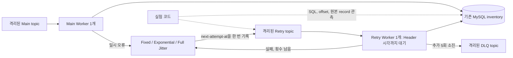

# Phase 4 - Retry 집중과 Backoff / Full Jitter 비교

## 1. 목표

기존 티켓 예매 프로젝트에서는 실패 메시지를 DLQ로 격리했지만, 장애 중 재시도 부하가 어떤 시간 분포를 갖는지는 검증하지 않았다. Phase 3에서 만든 Fixed Retry를 기준으로 Exponential Backoff와 Full Jitter를 비교했다. 평균 지연을 늘리는 것과 요청 시점을 분산하는 것의 효과를 구분하고, 현재 Worker 구조가 그 차이를 가리는지도 확인하려고 했다.

## 2. 배경 개념

최초 처리는 retry-count 0이고 추가 재시도는 1부터 시작한다. Fixed는 매번 base만큼 기다린다. Exponential은 `min(cap, base × 2^(n-1))`, Full Jitter는 같은 상한의 `[0, upper]`에서 나노초 단위 균등 난수를 뽑는다. 이 값은 실패 이후의 추가 대기 시간이지 최초 발행 시점 기준의 절대 시각이 아니다.

Backoff는 실패가 계속될수록 시도 간격을 늘리지만 같은 시점에 실패한 메시지는 다시 모일 수 있다. Jitter는 예약 시각을 분산하지만 짧은 지연을 뽑을 수도 있어 최대 횟수를 더 빨리 소진할 가능성도 있다. 어느 전략이 유리한지는 성공, DLQ, 미완료, 실제 처리 시각을 함께 봐야 판단할 수 있다.

## 3. 왜 필요한가

메시지가 Retry topic에 보존됐다는 사실만으로 복구 부하가 통제되지는 않는다. 장애 중 같은 record를 반복 처리하면 DB 연결과 Worker 자원을 사용한다. 반대로 Retry RPS가 낮더라도 Worker가 단순히 오래 막혀 있었다면 처리 개선이라고 볼 수 없다.

이번에는 DB transaction과 offset commit 순서를 바꾸지 않았다. Phase 2의 중복 재고 반영은 그대로 남겨두고, 재시도 시점에 관한 질문만 분리했다.

## 4. 시스템 구조



Kafka는 예약 시각 순서로 재정렬하지 않는다. 앞 offset이 미래 시각을 기다리는 동안 뒤 offset의 예약 시각이 지나도 같은 Worker는 진행할 수 없다. 범용 scheduler를 추가하면 비교 대상 구조 자체가 바뀌므로 이 제약을 유지했다.

## 5. 구현 과정

- `internal/inventory/delay.go`: 기존 Delay를 base로 사용하고 cap에서 포화되도록 계산했다. 반복 곱셈 전에 cap의 절반과 비교해 큰 retry-count에서도 overflow를 피했다.
- `internal/inventory/routing.go`: 발행할 때만 지연을 계산한다. 기존 7개 Header 계약과 원본 key/value는 유지한다.
- `internal/inventory/consumer.go`: Header 대기 후 실제 Retry 시작 시각과 초과 지연을 기록한다. DB 처리 함수와 공통 offset commit 위치는 그대로다.
- `cmd/worker/main.go`: 전략, cap, seed 옵션을 추가했다. Main과 Retry는 독립 RNG를 가지며 단일 Consumer 흐름에서만 사용한다.
- `tests/integration/phase4_test.go`: 기존 프로세스·Kafka 관측·SQL helper로 실제 MySQL 중단 실험을 구성했다. 고유 product, topic, group을 생성하고 원시 JSON은 `O_EXCL`로 새 파일에만 기록한다.
- `tests/integration/phase4_audit_test.go`: 원본 Header와 로그 경계를 대조하고, SQL 재고 및 broker offset으로 종료 상태를 확인한다. 결과 요약은 raw 파일 경로와 SHA-256을 포함한다.
- `.gitattributes`: 원시 JSON의 LF 줄바꿈을 고정해 Windows checkout의 자동 CRLF 변환으로 증거 hash가 바뀌지 않게 했다.

Phase 2 회귀 helper에는 새 topic leader 준비 대기를 보완했다. Phase 3 회귀 evidence 저장 경로를 외부에서 지정할 수 있게 해 과거 문서를 덮어쓰지 않도록 했다. 비즈니스 로직, Compose, 의존성은 바꾸지 않았다.

## 6. 핵심 코드

기본 실행은 `fixed`, `-retry-delay 2s`, `-max-retries 3`으로 Phase 3과 같다. 실험에서는 다음 옵션을 두 Worker에 동일하게 적용하고 seed만 각각 4101, 4102로 지정한다.

```powershell
go run ./cmd/worker -retry-strategy jitter -retry-delay 1s -retry-cap 8s -max-retries 5 -retry-seed 4101
go run ./cmd/worker -retry-worker -retry-strategy jitter -retry-delay 1s -retry-cap 8s -max-retries 5 -retry-seed 4102
```

위 예시는 전략 설정 설명이다. 실제 실험은 전용 topic/group을 설정하는 검증 스크립트로 실행한다. `-retry-delay`가 base이고 `-retry-cap`은 Exponential/Jitter에 적용한다. Fixed는 cap을 사용하지 않는다.

난수는 표준 `math/rand`를 사용한다. seed는 예약 난수열 재현을 위한 값이다. seed가 같아도 프로세스 실행과 DB 복구 시각까지 같아지는 것은 아니다. 각 Worker의 발행 순서에 맞춰 난수열을 다시 생성해 Header를 검증했다. Worker 재시작 시에는 이미 기록된 `next-attempt-at`을 읽으며 다시 추첨하지 않는다.

## 7. 실행 및 검증

```powershell
powershell -NoProfile -ExecutionPolicy Bypass -File scripts/verify-phase4.ps1 -Check All
```

시나리오 A는 60건을 ACK를 기다리며 지연 없이 연속 발행한다. 시나리오 B는 같은 60건을 200ms 간격, 목표 5건/초로 발행해 DB 장애와 복구에 걸쳐 유입시킨다. 각 실행은 상품 6개, 상품별 재고 100, quantity 1, topic별 partition 1, Main/Retry 각각 1개, Worker당 DB pool 1개다. DB 처리 timeout은 기존 10초, 연결 timeout은 기존 5초다.

DB 중단과 연결 실패를 확인한 시각을 t=0으로 삼는다. t=8초에 복구 명령을 요청하고 t=35초까지 관측한다. 실제 발행 시각, 복구 명령 반환, 첫 외부 `SELECT 1` 성공은 별도로 기록한다. Broker lag는 목표 500ms 간격으로 읽되 조회 시작과 완료 시각을 모두 보존한다.

실측 표와 15개 검증 판정은 [검증 보고서](phase-4-verification.md)에, 계산 결과와 개별 재시도 시각은 [Evidence](phase-4-evidence.json)에 있다. Evidence의 `File`이 가리키는 [원시 실행 파일](../experiments/phase4/)에는 Kafka record, Header, Worker PID와 전체 로그, SQL 재고, offset 시계열이 남아 있다.

## 8. 발생한 문제

첫 Fixed A 실행에서 복구 명령은 약 8초에 요청했지만 외부 SQL 연결 복구까지 24.498초가 걸렸다. 다른 실행과 같은 장애 길이로 비교할 수 없어 원본을 보존하고 해당 비교 셀을 다시 실행했다. 탐색 중 발견한 환경 통제 문제에 따라 비교용 실제 장애 길이를 8~12초로 제한했다. 이 기준은 사전 등록한 조건이 아니며, 성능 결과에 따른 선별 기준도 아니다.

복구 길이가 이 범위 안에 있어도 완전히 같지는 않다. 따라서 모든 DB가 확실히 내려가 있던 최초 8초의 Retry 집중을 공통 구간으로 별도 집계했다. 전체 복구 결과는 실제 장애 길이 차이의 영향을 포함한 관측으로 해석한다.

처음 회귀 실행은 Phase 2 A의 초기 broker snapshot 이전에 실패했다. 최초 실행의 전체 오류 출력이 보존되지 않아 정확한 오류 문구는 확인할 수 없다. 코드 점검에서 topic 생성 ACK 직후 leader 준비를 확인하지 않고 end offset을 읽는 경계를 확인해, 기존 Phase 3과 같은 준비 대기를 추가했다. 이후 회귀는 전체 출력을 별도 로그로 보존해 실행했다.

초기 집계는 Worker 출력을 모두 JSON으로 가정해 `[mysql] ... unexpected EOF` 진단에서 실패했다. JSON 로그만 해석하되 MySQL 드라이버 진단은 원시 파일에 보존하고 줄 수를 별도 기록하도록 수정했다. 알 수 없는 비JSON 출력은 계속 검증 실패로 처리한다.

## 9. 결과와 한계

동시 유입에서는 Exponential도 재시도 집중을 남겼다. Full Jitter의 예약 시각은 분산됐지만 FIFO 순서 때문에 실제 실행이 뒤로 밀렸다. 지속 유입에서는 Jitter의 전체 peak가 Exponential보다 높았고, 최초 8초 공통 구간 peak는 같았다. 단일 수치로 전략 우열을 정할 수 없었다.

HOL은 전체 overdue와 구분했다. 앞 offset이 미래 Header를 기다리는 구간 중, 뒤 record가 이미 발행 ACK를 받았고 예약 시각도 지난 구간만 합산했다. 이는 직접 확인 가능한 대기 기여의 하한이다. Fixed의 HOL 하한이 0이어도 앞 record의 DB 처리·발행·commit 때문에 뒤 record가 늦어지는 직렬 처리 대기는 존재한다.

이번 결과는 각 비교 셀 1회의 로컬 관측이다. 반복 seed, 전략 실행 순서 교차, 다중 Worker/partition, broker HA, 운영 규모 부하와 통계적 유의성은 검증하지 않았다. RPS는 애플리케이션 Retry 시작 수이며 실제 DB query 수나 드라이버 내부 연결 시도 수와 같지 않다. Host와 컨테이너 부하, DB 재기동 편차, 순차 offset 조회와 500ms sampling 오차도 남는다.

DB commit과 Kafka offset commit 사이의 중복, Retry 발행 ACK와 source commit 사이의 중복 발행 가능성도 남겨두었다. 이 실험의 성공 이벤트 집합 대조는 증거 검사이며 Idempotent Consumer 구현이 아니다.

## 10. 배운 점

지연 함수만 바꿔도 실제 실행 시각이 그대로 분산되지는 않았다. 예약 시각, 실제 시작, FIFO 대기와 DB 복구를 함께 관측해야 한다. 특히 낮은 RPS가 DLQ 조기 소진이나 느린 처리의 결과인지 확인해야 했다.

또한 컨테이너 복구 명령 완료와 서비스 복구는 다른 사건이었다. 동일한 명령 시각을 사용했다는 이유로 장애 길이가 같다고 가정하면 실험 결과를 잘못 해석할 수 있다. 통제되지 않은 실행을 남기고 공통 장애 구간을 분리한 것이 이번 비교에서 필요한 수정이었다.

## 11. 다음 Phase 연결

재시도 간격을 바꿔도 동일 메시지 재전달에 따른 중복 재고 반영은 막지 못한다. Phase 2 C의 before 데이터를 유지한 채 이후 Phase 5에서 MySQL transaction 안의 Idempotency를 검증할 근거를 남겼다. 해당 기능은 이번에 구현하지 않았다.

HOL 개선이 필요하다면 지연 예약과 실행을 분리하거나 처리 순서를 완화하는 대안을 검토할 수 있다. 다만 체크포인트·재시작·중복 발행 관리가 복잡해지고, partition을 늘리는 방법도 전역 예약 순서를 보장하지 않는다. 이번 Phase에서는 어느 대안도 구현하지 않았다.
