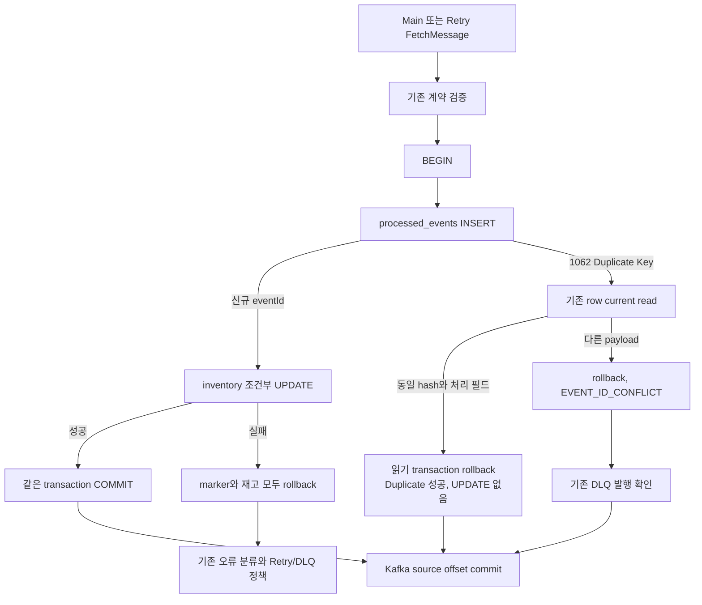
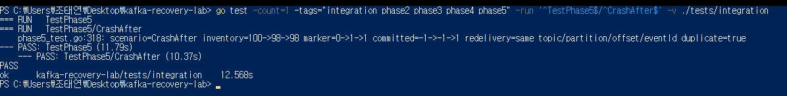

# Phase 5 - MySQL transaction으로 중복 재고 반영 차단

## 1. 목표

기존 티켓 예매 프로젝트에서는 실패 메시지를 DLQ로 보내는 기본 처리를 경험했지만, DB 성공과 Kafka offset commit 사이 장애는 충분히 다루지 못했다. Phase 2에서 의도적으로 그 경계를 끊었더니 같은 record가 다시 전달되고 재고가 100→98→96으로 감소했다. 이번에는 재전달을 허용하면서 같은 eventId의 성공한 재고 변경을 한 번만 적용하도록 만들었다.

## 2. 배경 개념

수동 offset commit은 DB 성공 전에 메시지를 건너뛰는 일을 막는다. 그러나 DB commit과 offset commit은 서로 다른 시스템의 작업이므로 그 사이에 프로세스가 종료되면 DB는 반영됐지만 Kafka는 완료 여부를 모른다. Kafka transaction을 사용하지 않는 현재 설계에서 이 두 commit을 원자적으로 묶었다고 주장할 수 없다.

따라서 Kafka record 좌표가 아닌 비즈니스 이벤트의 eventId를 DB 처리 완료 기준으로 삼았다. 같은 이벤트가 다른 Kafka offset이나 Retry topic으로 전달돼도 동일한 기준을 적용한다. Duplicate는 실패가 아니라 기존 성공을 확인한 결과다.

## 3. 왜 필요한가

처리 완료 marker를 먼저 별도 commit하면 재고 차감이 실패해도 이후 전달을 잘못 건너뛸 수 있다. 반대로 재고만 먼저 commit하고 marker를 기록하면 그 사이 장애에서 중복이 남는다. 두 기록을 같은 InnoDB transaction에 넣어야 했다.

동일 eventId라는 이유만으로 모든 payload를 무시하면 생산자 결함도 정상 duplicate로 숨겨진다. 그래서 eventId가 같아도 의미 있는 계약 필드가 다르면 명시적 `EVENT_ID_CONFLICT`로 격리한다.

## 4. 시스템 구조



정상 commit 직후의 기존 fault hook도 유지했다. Crash 이후 같은 topic/partition/offset/eventId가 다시 들어오면 두 번째 경로는 Duplicate가 되어 inventory UPDATE를 실행하지 않는다.

## 5. 구현 과정

`002_processed_events.sql`을 추가하고 기존 `init-inventory.ps1`에서 순서대로 적용한다. inventory schema는 바꾸지 않았다. ORM이나 migration framework도 추가하지 않았다.

| 컬럼 | 타입과 역할 |
| --- | --- |
| event_id | CHAR(36), ascii_bin, PRIMARY KEY; eventId의 중복 경쟁을 DB에서 중재 |
| payload_hash | BINARY(32); SHA-256 canonical payload |
| order_id | CHAR(36), ascii_bin; 원래 주문 식별자 |
| product_id | BIGINT; 반영 대상 |
| quantity | BIGINT; 반영 수량 |
| processed_at | DATETIME(6); transaction 안에서 UTC로 기록한 등록 시각 |

`processed_at`은 INSERT 시각이며 정확한 COMMIT 완료 시각은 아니다. row 자체는 성공한 transaction의 commit 후에만 다른 연결에 보인다.

`Store.Decrement`는 marker 등록 이후 기존 조건부 재고 UPDATE를 그대로 수행한다. MySQL 1062만 Duplicate Key로 분기하며 `INSERT IGNORE`를 사용하지 않는다. 그 외 오류는 기존 정책으로 전달한다. Domain rejection과 SQL timeout에서도 marker가 남지 않아야 한다.

## 6. 핵심 코드

`PayloadHash`는 검증된 v1 구조체의 여섯 필드(schemaVersion, eventId, orderId, productId, quantity, createdAt)를 고정된 필드 순서로 JSON 직렬화해 SHA-256을 계산한다. createdAt은 UTC로 정규화한다. 원본 JSON의 공백·필드 순서·Z와 +00:00 표기는 달라도 같은 값이다. Kafka 좌표, key, Retry Header는 hash에 넣지 않는다. key 검증은 기존 Consumer 계약에서 수행한다.

Duplicate INSERT는 경쟁 transaction의 결과를 기다린다. 이후 `SELECT ... FOR SHARE`로 현재 commit된 row를 읽어 hash와 order/product/quantity를 비교한다. REPEATABLE READ의 오래된 snapshot에 의존하지 않도록 locking read를 선택했다. 같은 payload면 UPDATE 없이 rollback해 잠금을 해제하고 `Result{Duplicate:true}`를 반환한다.

Consumer는 `inventory_duplicate`와 `inventory_committed`를 구분한다. Duplicate 결과를 오류로 분류하지 않으며 기존 공통 `CommitMessages` 지점으로 진행한다. 동일 함수가 Main과 Retry Worker 모두에 적용된다.

## 7. 실행 및 검증

```powershell
gofmt -l cmd internal tests
go test ./...
go vet ./...
go build ./...
go mod verify
```

검증은 새 product/topic/group을 만들고 기존 행이나 offset을 초기화하지 않는다. marker 개수·내용, SQL 재고, Kafka end/committed offset을 Worker 밖에서 조회했다. Worker PID와 원본 Kafka record, crash/restart 시점도 함께 대조했다.

핵심 결과는 Phase 2 Before **100→98→96**, Phase 5 After **100→98→98**이다. After에서는 첫 crash 직후 marker 1개와 재고 98, source committed -1을 확인했다. 재시작 후 같은 좌표를 읽었지만 재고와 marker timestamp/hash는 바뀌지 않고 offset만 1로 진행했다.



100회 Kafka 전달은 handler 100회, 신규 DB 반영 1회, Duplicate 99회였다. JSON 필드 순서와 UTC 표기를 바꾼 같은 이벤트도 포함했다. 별도 DB 연결 16개를 사용하는 동시 검증에서는 첫 transaction을 commit 전에 잡아두고, DB process list에서 경쟁 INSERT 15개를 확인한 뒤 해제했다. 신규 반영 1회, Duplicate 15회, marker 1개였다. 이것은 다중 Kafka Worker 검증이 아니라 동일 transaction 함수의 실제 DB 동시성 검증이다.

상세 판정·좌표·회귀 결과는 이 문서에 정리했다.

## 8. 발생한 문제

첫 실행의 CrashAfter와 CrashBefore는 Worker 처리 이전 Kafka topic 생성에서 5초 관리 요청 timeout으로 실패했다. 오류는 각각 `context deadline exceeded`, `i/o timeout`이었다. 다른 다섯 시나리오는 성공했다. 초기 로그와 실패 항목을 보존하고 실험용 CreateTopics 요청만 30초로 분리한 뒤 전체 7개 시나리오가 통과했다. 정확한 broker 지연의 근본 원인까지 확정하지는 않았다. Worker의 DB/Kafka 처리 제한은 늘리지 않았다.

과거 검증 결과를 덮지 않도록 Phase 4 helper에 raw/output 경로 지정만 추가했다. 검증 당시 이전 Phase 4 원본과 이번 회귀 원본을 분리했다. Phase 2 baseline은 기존 -phase2-baseline 옵션에서만 marker 처리를 우회한다. 기본 실행에는 우회가 없다.

Phase 4 회귀의 여섯 전략 시나리오는 모두 기능적으로 PASS했지만 네 실행의 실제 MySQL 장애 길이가 과거 성능 비교 조건인 8~12초를 벗어나 audit은 FAIL했다. 재측정에서도 12초 초과와 35초 내 미복구가 관측됐다. 로그에서 Phase 5 schema나 idempotency 변경에 의한 MySQL 오류는 확인되지 않았고 근본 원인은 `UNVERIFIED`다. Phase 5는 Retry delay·strategy·실험 계산을 변경하지 않았으므로 환경 시간이 맞을 때까지 성능 실험을 반복하지 않았다. 기존 Phase 4 evidence와 비교 기준은 그대로 보존했다.

## 9. 결과와 한계

이 구현은 marker가 보존되고 같은 eventId와 canonical 계약이 유지되는 범위에서 해당 MySQL 재고 side effect를 보호한다. 메시지 전달 자체가 exactly-once가 된 것은 아니다. Retry/DLQ 발행과 source commit 사이의 중복 발행도 여전히 가능하다.

새 이벤트마다 marker INSERT와 PK 유지 비용이 추가되고, Duplicate도 DB 연결·transaction·조회 비용을 사용한다. 같은 eventId가 몰리면 PK 잠금 경쟁이 생긴다. 이번 검증은 16개 동시 DB 호출까지이며 운영 규모 처리량, 장시간 경합, 여러 broker/Worker의 rebalance는 검증하지 않았다.

기존 Phase 0~4 처리 이력은 소급해 marker를 만들지 않았다. 과거에 이미 반영됐지만 marker가 없는 이벤트를 새로 전달하면 신규로 취급한다. marker 삭제 역시 재처리를 허용할 수 있으므로 실제 적용에서는 보존 기간과 재전달 가능 기간을 함께 정해야 한다. 이번에는 TTL, 삭제 정책, backfill을 추가하지 않았다.

createdAt이나 다른 계약 필드를 바꾼 eventId 재사용은 conflict다. 향후 schemaVersion이나 canonical 규칙을 바꾸려면 기존 hash와의 호환성을 설계해야 한다. hash만으로 모든 미래 계약 변화를 해결한다고 가정하지 않았다.

Idempotency key는 orderId가 아니라 eventId다. 같은 주문에 서로 다른 eventId를 발급하면 두 신규 이벤트로 처리되며, 주문 단위의 중복 생성 방지까지 구현한 것은 아니다.

## 10. 배운 점

수동 offset commit과 Idempotency는 다른 문제를 다룬다. 전자는 성공 전 진행을 막고, 후자는 이미 성공한 DB 작업이 재실행되는 것을 막는다. 재전달을 제거하려고 하기보다, DB가 기억하는 성공 범위를 transaction으로 묶는 것이 현재 구조에 맞았다.

중복이 오류인지도 구분해야 했다. 동일 이벤트의 재전달을 Retry하면 불필요한 부하를 만들고, 다른 payload를 duplicate로 숨기면 잘못된 입력을 놓친다. 실제 side effect와 handler invocation을 별도 계측한 이유다.

## 11. 다음 Phase 연결

DLQ에서 이벤트를 다시 전달하더라도 동일 eventId를 유지해야 이 계약을 사용할 수 있다. 그러나 DLQ를 실제로 다시 발행하는 기능과 복구 부하 통제는 별개의 문제다. 이후 Phase에서 검토할 근거만 남겼고 Replay, Recovery Worker/Topic, Rate Limit은 구현하지 않았다. Phase 4의 HOL 및 scheduler 구조도 그대로 유지했다.
