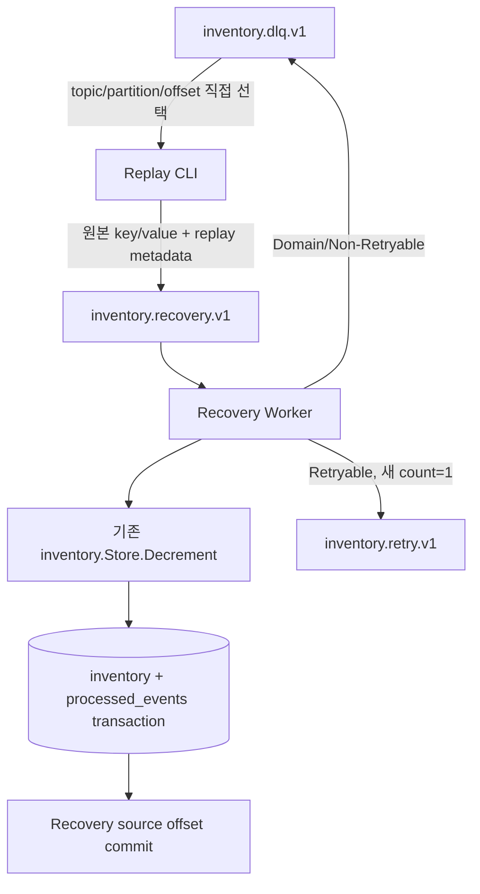

# Phase 6 - DLQ Replay와 Business Recovery

## 1. 목표

Phase 3에서 실패 record를 DLQ로 격리했지만 격리는 처리 중단 지점일 뿐 복구 완료가 아니었다. 이번 Phase에서는 운영자가 DLQ 좌표 한 건을 선택해 원본 eventId와 bytes를 Recovery Topic으로 다시 발행하고, 최종 MySQL 반영과 Recovery offset commit까지 확인했다.

## 2. 배경 개념

Replay publication과 business recovery는 서로 다른 성공 조건이다. Broker가 Recovery record를 승인해도 Worker가 처리하기 전에는 inventory와 processed_events가 바뀌지 않는다. 따라서 CLI 성공, Recovery Topic end offset, MySQL 상태, consumer group committed offset을 따로 관측했다.

DLQ는 삭제하지 않는다. 같은 DLQ record를 다시 선택할 수 있고, 그 결과 Recovery record가 중복될 수 있다. Phase 5의 eventId 기반 transaction이 이 중복에서 DB side effect를 보호한다.

## 3. 왜 필요한가

DLQ record를 JSON payload로 새로 만들거나 eventId를 재발급하면 기존 Idempotency 계약을 잃는다. 반대로 과거 `retry-count`와 `next-attempt-at`을 그대로 사용하면 복구 시도가 이미 소진된 chain에 묶인다. 원본 key/value와 business 좌표는 유지하고 Retry scheduling state만 새로 시작해야 했다.

## 4. 시스템 구조



Main, Retry, Recovery Worker는 같은 Consumer, FailurePolicy와 Store를 사용한다. Recovery 전용 비즈니스 처리 복사본은 없다.

## 5. 구현 과정

`cmd/replay`는 `-dlq-topic`, `-partition`, `-offset`으로 group 없는 Kafka Reader를 열어 정확히 한 record를 읽는다. DLQ envelope를 검증한 뒤 동기 writer로 Recovery Topic에 발행한다. Phase 6 검증에서는 CLI의 `-recovery-topic inventory.recovery.v1`을 명시했으며, 현재 Replay CLI와 Recovery Worker의 기본값도 `inventory.recovery.v1`로 일치한다. writer는 acks=all, MaxAttempts=1, 자동 Topic 생성 금지를 그대로 사용한다.

Recovery Worker는 기존 `cmd/worker -recovery-worker` 모드다. 기본 group은 `inventory-recovery-v1`이다. 기존 Store가 신규 event를 transaction으로 반영하고 Duplicate는 UPDATE 없이 공통 offset commit으로 보낸다.

DLQ envelope에는 replay 필드를 optional로 추가해 Phase 3~5 record도 읽는다. 새 DB table, ORM, replay marker는 추가하지 않았다.

## 6. 핵심 계약

Replay record에는 원래 `original-topic/partition/offset`과 현재 선택한 DLQ 좌표, 새 UUID `replay-id`, lineage의 `replay-count`를 넣는다. 기존 Retry scheduling header 네 개는 제거한다. application header는 유지하되 예약 header는 새 값으로 교체한다.

Recovery에서 일시 DB 오류가 발생하면 기존 Retry Topic으로 이동하면서 `retry-count=1`부터 시작한다. replay header와 원래 business 좌표는 Retry와 이후 DLQ에도 유지된다. 이전 Recovery 실패 DLQ를 다시 선택하면 envelope의 count에 1을 더한다. DB가 없으므로 이 값은 해당 DLQ lineage만 나타내며 전역 누적 횟수가 아니다.

malformed JSON envelope, key/value 누락, 잘못된 원본 좌표, 불완전하거나 잘못된 replay metadata는 보정하지 않고 거절한다.

## 7. 실행 및 검증

```powershell
powershell -NoProfile -ExecutionPolicy Bypass -File scripts/verify-phase6.ps1 -Check All
```

실제 Retry Exhaustion DLQ를 선택한 첫 CLI 성공 직후 inventory 100, marker 0, Recovery end 1, committed -1이었다. Recovery Worker가 처리한 뒤 inventory 98, marker 1, committed 1이 됐다. 같은 DLQ를 다시 Replay한 record는 Duplicate로 처리돼 inventory 98과 marker 1을 유지하고 committed만 2로 진행했다.

Recovery DB 연결 실패는 retry-count=1 record를 만들었고 정상 Retry Worker가 처리해 inventory 98과 marker 1을 만들었다. 상품 없음은 다시 DLQ로 이동했고, 그 DLQ를 재Replay한 결과 실제 envelope count가 1에서 2로 증가했다. 상세 좌표와 PID는 [검증 보고서](phase-6-verification.md)에 정리했다.

## 8. 발생한 문제

작업 시작 시 Docker daemon이 중지돼 실제 검증을 실행할 수 없었다. Docker Desktop을 기동하고 기존 Compose Kafka/MySQL healthcheck가 통과한 뒤 시나리오를 실행했다. MySQL 컨테이너 재기동 시간 편차를 피하기 위해 Retry Exhaustion은 Worker 하나의 DB port를 닫힌 port로 지정했다. 이는 실제 TCP connection refusal이며, 다른 시나리오의 정상 DB에는 영향을 주지 않았다.

첫 evidence Regression은 Phase 4 JSON의 `Status` 키를 `status`로 조회해 실패했다. Phase 4 evidence는 수정하지 않고 검사 코드의 schema 일치만 고친 뒤 PASS했다.

## 9. 결과와 한계

DLQ record를 Recovery Topic에 넣는 행위와 실제 DB 복구 완료를 분리해 관측할 수 있게 됐다. 동일 DLQ를 두 번 Replay해도 같은 eventId의 inventory side effect는 한 번만 발생했다. 실패 원인이 남은 record는 성공으로 오인하지 않고 새 DLQ와 replay lineage를 남겼다.

Replay CLI는 한 번에 한 record만 처리한다. 목록 조회, bulk selection, rate limiting, checkpoint, resume가 없다. DLQ와 Recovery 사이에 Kafka transaction을 사용하지 않으므로 broker 승인 후 CLI 결과를 잃으면 재실행으로 Recovery record가 중복될 수 있다. Idempotency가 DB effect를 보호하지만 Kafka 저장량과 처리 호출 비용은 남는다.

## 10. 배운 점

복구 완료는 DLQ에서 record를 꺼냈다는 사실로 판단할 수 없었다. Recovery source commit과 processed marker, 최종 inventory를 함께 봐야 했다. 또한 Retry 횟수와 Replay 횟수는 서로 다른 의미이므로 scheduling state는 초기화하고 lineage 정보는 별도 header로 이어야 했다.

## 11. 다음 Phase 연결

현재 CLI는 운영자가 지정한 한 건만 동기 발행한다. 많은 DLQ record를 Replay하면 Recovery backlog와 DB 부하가 새 장애가 될 수 있다. Phase 7에서 bulk selection, publication rate와 Recovery 처리 부하를 다룰 근거만 마련했으며 Rate Limiter, checkpoint, scheduler는 구현하지 않았다.
