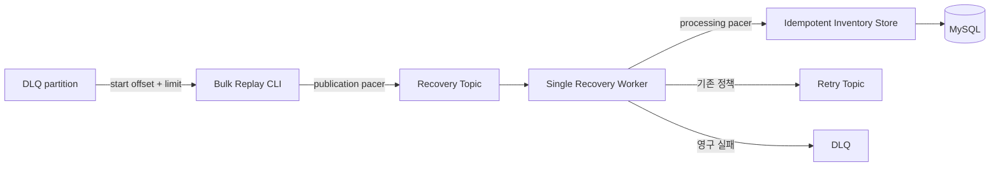

# Phase 7 - Bulk Replay와 Recovery Rate Limiting

## 1. 목표

Phase 6에서는 운영자가 지정한 DLQ record 한 건을 실제 DB까지 복구했다. 이번 Phase에서는 한 partition의 연속 DLQ record를 bulk로 Replay하고, Recovery Topic 발행 속도와 Recovery business 처리 시작 속도를 서로 다른 지점에서 제한해 대량 복구가 만드는 부하를 실제 Kafka/MySQL로 비교했다.

## 2. 배경 개념

Replay publication rate와 Recovery processing rate는 같은 값이 아니다. Producer pacing은 Recovery Topic 유입을 늦추지만 이미 backlog가 쌓였거나 Consumer가 record를 묶어 전달하면 DB 처리 시작의 순간 peak를 직접 제한하지 못한다. 반대로 Recovery Worker의 limiter는 record를 읽은 뒤 Store 진입 전에 동작하므로 기존 backlog에서도 DB 처리 시작 속도를 제한한다.

CLI 완료와 business recovery 완료도 분리했다. CLI가 모든 발행 ack를 받았어도 Recovery committed offset과 MySQL marker가 끝까지 진행하기 전에는 복구 완료가 아니다.

## 3. 왜 필요한가

DLQ 1건의 안전한 복구가 수백 건 Replay의 안전성을 보장하지 않는다. 제한 없는 발행은 Recovery backlog를 빠르게 만들 수 있고, Producer rate만 제한하면 Consumer·DB의 실제 peak가 같은 상한을 따른다고 오판할 수 있다. 두 제어 지점을 독립적으로 측정해야 운영자가 유입 속도와 DB 부하를 구분해 선택할 수 있다.

## 4. 시스템 구조

Main Worker와 Retry Worker에는 Recovery limiter를 적용하지 않았다. Recovery Worker도 기존 Consumer, FailurePolicy, Store를 그대로 사용한다.

## 5. 구현 과정

기존 `cmd/replay`의 `-partition -offset` 단건 계약을 유지하고 `-partition -start-offset -limit` bulk 모드를 추가했다. group 없는 Reader가 지정 offset부터 순서대로 정확히 N건을 읽으며 DLQ consumer group offset과 record를 변경하지 않는다. 각 record는 새 `replay-id`와 기존 Phase 6 metadata, 원본 key/value를 유지한다. 한 실행의 로그 상관관계는 `batchId`로 묶는다.

`-publish-rate`는 동기 Kafka write 직전에 단일 timer pacer를 적용한다. `-recovery-rate`는 Recovery record decode와 key 검증 뒤, Inventory Store 호출 직전에 적용한다. 둘 다 0이면 제한이 없고 context 취소를 전달한다. 외부 rate limit dependency, worker pool, DB table은 추가하지 않았다.

Bulk 중 malformed envelope를 만나면 해당 DLQ 좌표와 이미 발행된 수를 보고하고 중단한다. 앞서 ack된 Recovery record를 되돌리지 않는다.

## 6. 핵심 계약

- 단건과 bulk selection은 동시에 지정할 수 없다.
- Bulk는 한 partition의 연속 offset만 처리하며 자동 partition 탐색을 하지 않는다.
- 각 Recovery record는 `replay-id`, `replay-count`, `replayed-from-dlq-topic/partition/offset`을 가진다.
- Publication limiter와 Recovery limiter는 첫 실행을 즉시 허용하고 이후 시작 간격을 평균 rate에 맞춘다.
- Recovery limiter는 Recovery Topic에서 시작되는 최초 business 처리만 통제한다. 이후 Retry Topic 처리는 전역 quota에 포함하지 않는다.
- 같은 DLQ 범위를 다시 Replay해도 eventId 기반 transaction이 inventory 중복 변경을 막는다.

## 7. 실행 및 검증

120건을 12개 product에 round-robin으로 배치했다. 각 전략은 새 eventId, product 집합, DLQ/Recovery/Retry topic과 consumer group을 사용했다. fixture는 기존 DLQ envelope 계약으로 실제 Kafka DLQ Topic에 넣었으며 실제 Retry Exhaustion 결과로 표현하지 않는다.

| 전략 | publish / recovery 설정 | 발행 평균 / peak | 처리 평균 / peak | peak lag | CLI | business 완료 | 성공 / DLQ / 미완료 |
| --- | --- | ---: | ---: | ---: | ---: | ---: | ---: |
| Unlimited | 0 / 0 | 72.48 / 81 | 73.63 / 81 | 5 | 2,498 ms | 2,498 ms | 120 / 0 / 0 |
| Publication Limited | 20 / 0 | 19.62 / 20 | 19.62 / 23 | 3 | 6,842 ms | 6,842 ms | 120 / 0 / 0 |
| Backlog + Recovery Limited | 0 / 20 | 72.80 / 81 | 19.59 / 20 | 120 | 2,196 ms | 8,355 ms | 120 / 0 / 0 |

세 전략 모두 inventory 합계 12,000→11,880, processed_events 120건이었다. peak는 임의의 1초 sliding window 안의 시도 수이며 정확한 장기 RPS 보장값으로 해석하지 않는다. 상세 timestamp, 초별 bin, offset, PID와 raw hash는 [Evidence](phase-7-evidence.json)에 있다.

Bulk 24건을 같은 범위로 두 번 Replay한 결과 첫 실행은 신규 24건, 두 번째는 Duplicate 24건이었다. inventory 11,976과 marker 24는 두 번째 실행 뒤에도 같았고 Recovery committed offset만 24→48로 진행했다. 단건 CLI 회귀도 1건 DB 반영과 committed 1을 확인했다.

## 8. 발생한 문제

초기 단위 검증에서 CLI의 `-recovery-topic` flag 등록 누락이 발견됐다. Phase 6 단건 계약도 깨지는 오류였으므로 기존 기본값과 flag를 복구하고 단건/bulk parsing 테스트를 다시 통과시켰다.

Publication Limited의 발행 peak는 20이었지만 Recovery 처리 peak는 23이었다. Kafka 전달과 Worker scheduling이 처리 시작을 순간적으로 모을 수 있으므로 Producer limiter가 DB peak limiter라는 가정을 버리고 실측값을 그대로 보존했다.

## 9. 결과와 한계

기존 backlog 120건에서 Recovery limiter는 처리 평균 19.59/s, peak 20으로 Store 진입을 pacing했다. 같은 실행의 CLI는 2.196초에 끝났지만 business recovery는 8.355초가 걸려 두 완료 경계가 분리됐다. 반대로 Publication Limited는 유입 평균을 19.62/s로 낮췄지만 처리 peak 상한까지 보장하지 않았다.

중간 실패 실험은 offset 0 발행 성공 후 malformed offset 1에서 중단됐고 Recovery end는 1, DLQ end는 3, DLQ committed는 -1이었다. persistent checkpoint가 없으므로 CLI crash나 재실행은 이미 발행된 record를 다시 만들 수 있다. Idempotency가 DB side effect는 보호하지만 Kafka duplicate와 처리 비용은 남는다.

여러 partition 자동 분배, checkpoint/resume, pause, distributed limiter, worker pool, 전체 Replay lineage의 Retry quota, Prometheus/Grafana, 운영 규모 반복 통계는 구현하거나 검증하지 않았다.

## 10. 배운 점

부하 제어 위치가 관측 대상의 상한을 결정했다. Producer 앞 limiter는 Topic 유입을 제어하고 Store 앞 limiter는 Recovery backlog에서 DB 처리 시작을 제어했다. 성공 건수와 reconciliation을 함께 보지 않으면 낮은 peak가 단순 실패나 미완료 때문인지 구분할 수 없었다.

또한 rate 제한으로 실행 시간이 늘어나는 것은 처리 능력 개선을 뜻하지 않는다. 이번 결과는 1회 로컬 실험의 pacing과 경계 분리 증거이며 성능 향상률로 일반화하지 않는다.

## 11. 다음 Phase 연결

Phase 7은 bulk Replay의 두 rate 제어 지점과 checkpoint 부재의 비용까지 확인했다. Phase 8의 기능은 구현하지 않았다. 이후 단계가 persistent run/checkpoint, multi-partition scheduling 또는 관측 체계를 다룰지는 별도 설계와 요청이 필요하다.
