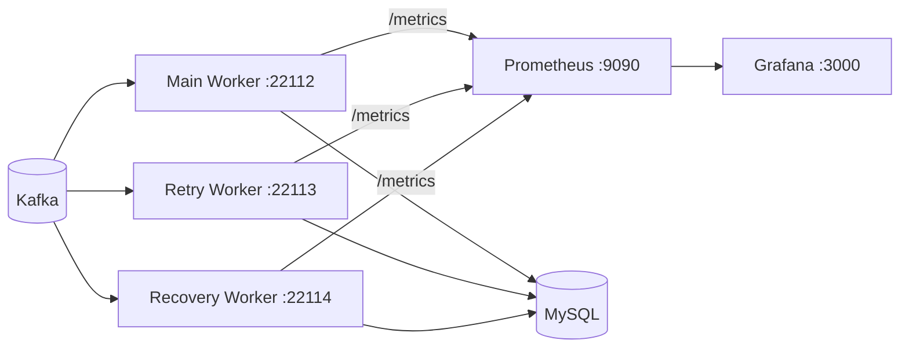

# Phase 8 - Prometheus / Grafana Observability

## 1. 목표

Phase 3~7에서 Retry, DLQ, Idempotency, Recovery와 rate limiting을 구현했지만 현재 상태를 확인하려면 structured log와 실험 JSON을 직접 읽어야 했다. 이번 Phase에서는 기존 transaction, route와 offset 순서를 유지하면서 운영 판단에 필요한 집계 metric을 Worker에서 노출하고 Prometheus와 Grafana에서 실제 변화량을 확인했다.

## 2. 배경 개념

개별 event 추적과 집계 관측은 목적이 다르다. eventId, orderId, productId, replayId, Kafka offset은 로그와 evidence에 남기고 metric label에는 넣지 않았다. Worker 역할, 처리 결과, Retry 전략과 코드에 정의된 오류 분류만 bounded label로 사용했다.

Counter는 unique business event 수가 아니라 각 Consumer 처리 시도의 최종 route를 센다. DB commit 성공 뒤 source offset commit이 실패해 record가 재전달되면 처리 시도 역시 다시 관측될 수 있다. Idempotency의 Duplicate metric과 함께 해석해야 한다.

## 3. 왜 필요한가

DLQ와 Retry record가 생겼다는 로그만으로는 현재 발생률, Worker별 처리량, latency 또는 Recovery limiter 대기를 즉시 판단하기 어렵다. 반대로 식별자를 label에 넣으면 시계열 수가 메시지 수에 비례해 증가한다. 운영 질문에 답하는 최소 집계값과 고정된 cardinality 계약이 필요했다.

## 4. 시스템 구조

Go Worker는 Windows host에서 실행하고 Prometheus는 Compose container에서 `host.docker.internal`로 scrape한다. Metrics endpoint는 `-metrics-address`가 비어 있으면 비활성화되므로 기존 검증 프로세스와 포트 충돌을 만들지 않는다.

## 5. 구현 과정

`inventory.Consume`의 기존 결과 분기에 Observer를 연결했다. Store 호출 전후 시간만 processing histogram에 넣고 Kafka fetch와 Retry 대기는 제외했다. Retry/DLQ publication이 성공한 뒤 해당 counter를 증가시키며, 동일 처리 시도에서 consumer outcome은 success, duplicate, retry, dlq, error 중 하나만 선택한다.

Recovery pacer는 실제 대기 시간을 반환하도록 확장했다. 0보다 큰 wait만 histogram에 기록해 unlimited 실행에 가짜 관측값을 만들지 않았다. Metric callback은 반환 오류가 없고 DB transaction 또는 Kafka commit 조건에 참여하지 않는다.

각 Worker는 process 전용 Prometheus Registry와 `/metrics` server를 사용한다. server는 기존 context 취소 시 최대 5초 shutdown한다. Prometheus client의 CounterVec/HistogramVec는 bounded label 조합을 0으로 사전 등록해 dashboard series가 첫 사건 전에도 존재하게 했다.

## 6. 핵심 계약

| Metric | Labels | 의미 |
| --- | --- | --- |
| `inventory_consumer_records_total` | worker, outcome | source commit 전 확정된 처리 시도 결과 |
| `inventory_processing_duration_seconds` | worker, outcome | Inventory Store 호출 구간 |
| `inventory_retry_published_total` | worker, error_code | ack를 받은 Retry publication |
| `inventory_dlq_published_total` | worker, error_code | ack를 받은 DLQ publication |
| `inventory_duplicate_total` | worker | Store가 반환한 실제 Duplicate |
| `inventory_retry_overdue_seconds` | strategy | max(실제 시작-next-attempt-at, 0) |
| `inventory_recovery_processed_total` | outcome | Recovery Store가 결과를 반환한 record |
| `inventory_recovery_rate_limit_wait_seconds` | 없음 | Recovery limiter의 실제 양수 대기 |

worker는 main/retry/recovery, outcome은 success/duplicate/retry/dlq/error, strategy는 fixed/exponential/jitter/unknown으로 제한했다. error_code는 애플리케이션이 정의한 13개 코드와 UNKNOWN만 허용한다. 정의 밖 문자열은 UNKNOWN으로 정규화한다.

## 7. 실행 및 검증

Prometheus scrape interval은 2초다. 세 Worker target은 실험 중 모두 UP이었다. 실제 시나리오 전후 Prometheus instant query 결과는 다음과 같다.

| 시나리오 | Query 관측 | 전 → 후 | 외부 상태 |
| --- | --- | ---: | --- |
| Normal | main success | 0 → 1 | inventory 100→98, main committed 1 |
| Processing latency | success histogram count | 0 → 1 | 같은 Store 성공 |
| Duplicate | main duplicate | 0 → 1 | inventory 98 유지, marker 1 |
| DLQ | MALFORMED_JSON DLQ | 0 → 1 | main committed 3, DLQ 생성 |
| Retry | DB_CONNECTION Retry | 0 → 1 | failed Main committed 1, Retry committed 1, inventory 100→97 |
| Retry Worker | retry success | 0 → 1 | processed marker 1 |
| Retry overdue | fixed histogram count | 0 → 1 | persisted next-attempt-at 이후 시작 |
| Recovery | recovery success | 0 → 1 | 단건 Replay, inventory 100→99 |
| Recovery rate limit | wait histogram count | 0 → 9 | 10건, 5/s, Recovery committed 11 |

Kafka 최종 상태는 main committed 3, failed Main 1, Retry 1, Recovery end/committed 11, DLQ end 12였다. 소규모 rate-limit 10건은 각각 inventory 100→99와 marker 1을 확인했다. 실제 PID, query timestamp, topic/group, raw source hash는 [Evidence](phase-8-evidence.json)에 있다.

Grafana datasource UID `prometheus`는 `http://prometheus:9090`으로 provision됐다. `Kafka Recovery Lab` dashboard는 9개 panel과 10개 PromQL target을 가지며 모두 Grafana datasource proxy를 통해 `status=success`를 반환했다.

## 8. 발생한 문제

Docker Desktop이 중지돼 최초 이미지 pull이 실패했고 daemon 기동 후 재시도했다. Windows가 TCP 2038~2137을 예약해 예시 포트 2112~2114 bind가 거절됐으므로 repository 기본 target을 22112~22114로 변경했다.

검증 harness에서 단건 Replay에 빈 limit flag를 전달한 오류와, 앞선 malformed DLQ offset을 단건 Recovery 대상으로 잘못 선택한 오류를 각각 수정했다. 마지막으로 Prometheus label vector는 사건 전 child series가 출력되지 않아 descriptor audit이 실패했다. bounded 조합만 0으로 사전 등록해 해결했다. 네 실패 실행 raw는 삭제하거나 PASS로 바꾸지 않았다.

Phase 1 Build checker는 역사적으로 go.mod/go.sum 무변경을 강제하므로 허용된 Prometheus dependency를 실패로 판단했다. 과거 checker는 수정하지 않고 Phase 8 Build가 전체 `go test`, `go vet`, `go build`, `go mod verify`와 모든 integration tag compile/vet을 직접 수행하게 했다.

## 9. 결과와 한계

Metric 변화와 DB inventory, processed_events, Kafka end/committed offset을 같은 실행에서 대조했다. 실제 `/metrics` label 이름은 error_code, le, outcome, strategy, worker뿐이며 event/order/product/replay/batch/offset과 동적 topic은 label에 없었다.

정확한 committed consumer-group lag Gauge는 구현하지 않았다. kafka-go Worker 안에서 last-observed high-water mark만 노출하면 committed group lag로 오해할 수 있고, 별도 broker/group polling collector는 현재 범위를 키운다. 따라서 lag panel도 만들지 않았으며 이 항목은 `UNVERIFIED`다.

Replay CLI는 short-lived process라 Prometheus pull 대상에서 제외했다. Pushgateway를 추가하지 않았고 publication RPS와 duration은 Phase 7 structured log/evidence에 남는다. Metrics server는 local Compose scrape를 위해 모든 host interface에 bind하므로 운영 배포 시 방화벽과 별도 network 정책이 필요하다.

## 10. 배운 점

Metric 이름이 보인다는 사실만으로 관측 검증이 끝나지 않았다. scenario 전후 counter와 histogram count의 증가, 실제 SQL 상태, Kafka offset을 함께 확인해야 metric 의미가 business 결과와 일치하는지 판단할 수 있었다.

또한 cardinality는 label 이름만 제한해서 끝나지 않는다. error_code처럼 허용된 label도 입력을 whitelist로 정규화해야 raw driver 오류가 시계열을 계속 생성하지 않는다. 사건 전 0 series 등록도 dashboard 재현성과 cardinality budget 안에서 명시적으로 설계해야 했다.

## 11. 다음 Phase 연결

Phase 8은 현재 장애·복구 흐름을 저 cardinality metric과 재현 가능한 dashboard로 관측할 수 있게 했다. Alertmanager, tracing, log aggregation, exporter, checkpoint와 Phase 9 기능은 추가하지 않았다. 정확한 committed lag, alert 정책 또는 운영 network 구성은 별도 요구와 설계가 필요하다.
